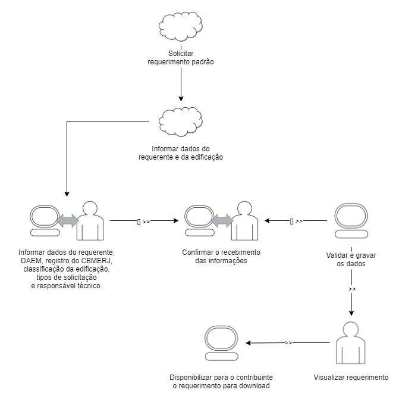
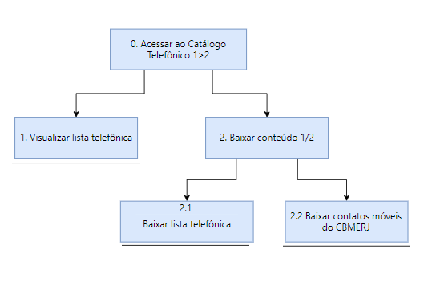

## Introdução
A análise de tarefas é muito importante para compreender como os usuários realizam suas atividades, os objetivos que buscam alcançar e os desafios enfrentados no processo. Segundo Diaper (2003), ela engloba métodos para coletar, classificar e interpretar dados sobre o desempenho de sistemas que incluem pelo menos uma pessoa como componente. Essa abordagem é essencial tanto para a análise da situação atual quanto para o (re)design de sistemas computacionais, além de ser fundamental na avaliação de intervenções que introduzem novos sistemas.

### Metodologia
Entre os métodos mais comuns de análise de tarefas, destacam-se a Análise Hierárquica de Tarefas (HTA), que descreve as tarefas em uma hierarquia; o GOMS, que desmembra as tarefas em metas, operadores, métodos e regras de seleção; e o ConcurTaskTrees (CTT), que permite representar visualmente as tarefas e as condições de concorrência entre elas.

Para cada funcionalidade analisada, iremos aplicar  dois métodos, Análise Hierárquica de Tarefas e Árvores de Tarefas Concorrentes. Abaixo, descrevemos brevemente Todos os métodos:

### Análise Hierárquica de Tarefas (HTA)

A Análise Hierárquica de Tarefas (HTA) é uma abordagem utilizada para quebrar uma tarefa complexa em sub-tarefas menores, facilitando a compreensão do processo geral.

De acordo com Stanton et al. no livro "Human Factors Methods: A Practical Guide for Engineering and Design", a HTA "é um método para descrever uma tarefa complexa ao dividi-la em sub-tarefas menores e mais gerenciáveis, o que ajuda na visualização organizada para compreender e melhorar a experiência do usuário. 

Etapas básicas da HTA:

Definição do Objetivo: Comece definindo o objetivo principal da tarefa. A clareza do propósito é fundamental.
Divisão em Sub-tarefas: Em seguida, divida a tarefa em componentes menores. Isso ajuda a compreender as partes individuais da tarefa.
Estruturação Hierárquica: Organize as sub-tarefas em uma estrutura que mostre sua relação hierárquica.
Sequência e Relações: Determine a sequência ideal e as dependências entre as sub-tarefas.
Recursos e Restrições: Identifique os recursos necessários para cada sub-tarefa, bem como as restrições que possam afetar seu andamento.
A HTA é amplamente utilizada para avaliar a usabilidade de interfaces e identificar áreas de melhoria. Kirwan & Ainsworth, em seu livro "A Guide to Task Analysis", destacam que a HTA "permite uma análise estruturada do trabalho e fornece uma visão geral dos componentes críticos de uma tarefa complexa, ajudando a otimizar processos".

### Árvores de Tarefas Concorrentes (ConcurTaskTrees – CTT)

As Árvores de Tarefas Concorrentes, ou Árvores de Tarefas Paralelas, são uma estrutura visual usada para representar a relação entre tarefas que podem ser realizadas simultaneamente ou em uma ordem flexível. Elas são especialmente úteis em projetos de interação humano-computador, onde a multitarefa é comum. Em vez de uma sequência linear de atividades, as Árvores de Tarefas Concorrentes demonstram como diferentes tarefas podem ocorrer ao mesmo tempo.

Componentes das Árvores de Tarefas Concorrentes:

Nó Raiz: O ponto de partida da árvore, representando o objetivo ou a tarefa principal.
Ramos Paralelos: Diferentemente das árvores de tarefas tradicionais, as Árvores de Tarefas Concorrentes permitem ramos que representam tarefas que podem ser executadas simultaneamente.
Nós de Sincronização: Estes nós indicam onde diferentes ramos precisam convergir para continuar o processo, sinalizando pontos de junção ou sincronização entre tarefas.
Dependências: As Árvores de Tarefas Concorrentes destacam as relações de dependência entre as tarefas, indicando quais atividades precisam ser concluídas antes que outras possam começar.
As Árvores de Tarefas Concorrentes são amplamente usadas para mapear processos de trabalho complexos ou interfaces de usuário que suportam multitarefa. Elas também ajudam a identificar oportunidades para otimizar fluxos de trabalho e aumentar a eficiência.

Árvores de Tarefas Concorrentes permitem uma compreensão mais clara das tarefas que podem ser realizadas em paralelo, facilitando a análise de processos e a otimização de sistemas para maior eficiência e flexibilidade".

### GOMS (Goals, Operators, Methods, and Selection Rules)

O modelo GOMS (Goals, Operators, Methods, and Selection Rules) é uma abordagem analítica usada para entender as interações humanas com sistemas computacionais, especialmente no contexto de interfaces de usuário. 

De acordo com Card, Moran e Newell, que introduziram o modelo no livro "The Psychology of Human-Computer Interaction", o GOMS "é uma estrutura que descreve como os usuários interagem com sistemas computacionais, identificando objetivos, operações, métodos e regras de seleção para alcançar esses objetivos".

Componentes do Modelo GOMS (Acrônimo formado pelas etapas):

Objetivos (Goals): Os objetivos representam o resultado final que o usuário busca atingir. 
Operadores (Operators): Os operadores são as ações que o usuário executa para alcançar um objetivo, como pressionar teclas.
Métodos (Methods): Os métodos são sequências de operadores usadas para atingir um objetivo específico. 
Regras de Seleção (Selection Rules): As regras de seleção determinam qual método será usado quando há mais de um disponível. Essas regras ajudam a definir o comportamento do usuário em diferentes contextos.

## Análise de Tarefas

### 1. Solicitação de Requerimento Padrão
A Solicitação de Requerimento Padrão refere-se ao processo de regularização legal de edificações junto ao Corpo de Bombeiros do Rio de Janeiro. Isso envolve o preenchimento e submissão de um requerimento padrão.

Para essa análise, foram aplicadas as técnicas de Análise Hierárquica de Tarefas e Árvores de Tarefas Concorrentes.

**Análise Hierárquica de Tarefas:** A figura 1 e a tabela 1 apresentam a análise hierárquica dessa tarefa em sua forma textual e de diagrama, respectivamente.

|    Objetivos/Operações    |    Problemas e recomendações    |
| :-----------------------: | ------------------------------- | 
| 0. Solicitar requerimento padrão 1>2    | **input:** Acessar o menu de cidadão na tela inicial.  **feedback:** Carregar formulário para início da solicitação.   **plano:** Gerar o requerimento padrão solicitado.  **recomendação:** Fazer tratamento de erros do formulário. | 
| 1. Informar dados do requerente e da edificação 1+2  | **plano:** Informar dados do requerente; DAEM, registro do CBMERJ, classificação da edificação, tipos de solicitação e responsável técnico. |
| 1.1 Informar nome, endereço, telefone, cpf e registro do requerente; DAEM e registro do CBMERJ. |
| 1.2 Informar classificação da edificação, tipos de solicitação e responsável técnico 1/2 |
| 2. Confirmar o recebimento das informações | **ação:** Disponibilizar para o contribuinte o requerimento para download.  **recomendação:** Retornar mensagens de erro claras quando alguma das informação não é preenchida corretamente. |

Tabela 1: Análise hierárquica da tarefa "Solicitação de Requerimento Padrão" (Fonte: Bruna Lima, 2024). 

Figura 1 - Diagrama da Análise hierárquica da "Solicitação de Requerimento Padrão" (Fonte: Bruna Lima, 2024). 

**Árvores de Tarefas Concorrentes:** A figura 2 contém a análise representada em diagrama da tarefa de "Solicitação de Requerimento Padrão" com uso da técnica de Árvores de Tarefas Concorrentes.

Figura 2 - Diagrama da Árvores de Tarefas Concorrentes da "Solicitação de Requerimento Padrão" (Fonte: Bruna Lima, 2024). 

### 2. Locais certificados

A aba "Locais certificados" é uma funcionalidade que disponibiliza uma relação de locais de Diversões Públicas autorizados a funcionar. Para a análise dessa funcionalidade, foram aplicadas as técnicas de Análise Hierárquica de Tarefas e Árvores de Tarefas Concorrentes. 

**Análise Hierárquica de Tarefas:** A tabela 2 apresenta a análise hierárquica dessa tarefa em sua forma textual.

|    Objetivos/Operações    |    Problemas e recomendações    |
| :-----------------------: | ------------------------------- | 
| 0. Acessar a lista de Locais de Diversões Públicas Autorizados a funcionar 1 + 2. | **input:** Acessar o menu de cidadão na tela inicial.  **feedback:** Apresentar a lista de locais autorizados.   **plano:** Exibir informações atualizadas sobre os locais de diversão pública autorizados.  **recomendação:** Implementar filtros de pesquisa para facilitar a localização dos estabelecimentos. | 
| 1. Visualizar dados dos locais e suas autorizações 1 + 2.  | **plano:** Exibir informações detalhadas sobre cada local, incluindo: nome, endereço, capacidade de lotação, validade da autorização, classificação da finalidade da edificação e responsáveis pela edificação. |
| 2. Confirmar a disponibilidade da lista atualizada. | **ação:** Disponibilizar lista para visualização e download.  **recomendação:** Garantir que a lista seja regularmente atualizada para refletir as mais recentes autorizações concedidas.  |
| 3. Facilitar o acesso à informação. | **ação:** Disponibilizar uma interface de fácil navegação e busca rápida.  **recomendação:** Certificar-se de que a plataforma seja acessível em diferentes dispositivos e navegadores. |

Tabela 2 - Análise hierárquica da aba "Locais certificados" (Fonte: Daniela Alarcão, 2024). 

**Árvores de Tarefas Concorrentes:** A figura 3 apresenta a análise dessa tarefa, representada em diagrama, com o uso da técnica de Árvores de Tarefas Concorrentes. 

Figura 3 - Diagrama da Árvores de Tarefas Concorrentes de "Locais certificados" (Fonte: Daniela Alarcão, 2024). 

### 3. Sistema de gestão de emergências integrado

O acesso a funcionalidade de Comunicação de Emergência refere-se a um meio de comunicação robusto que permite a coordenação eficiente entre os bombeiros, serviços de emergência e outras agências relevantes. Isso pode incluir mensagens de texto em massa, alertas de emergência e comunicação por voz em tempo real.

Para essa análise, foram aplicadas as técnicas de Análise Hierárquica de Tarefas e Árvores de Tarefas Concorrentes.

A figura 4 e 5 apresentadas a seguir nesta ordem, mostra a Análise Hierárquica de Tarefase e a Árvores de Tarefas Concorrentes.

- Análise Hierárquica de Tarefas

  

Figura 4 - Análise Hierárquica de Tarefas (Fonte: Genilson Junior, 2024)  

- Árvores de Tarefas Concorrentes

  

Figura 5 - Árvores de Tarefas Concorrentes (Fonte: Genilson Junior, 2024)  

### 4. Acesso a informações sobre concurso

Em relação ao Acesso a informações sobre o concurso, essa é uma funcionalidade do  site com o objetivo de fornecer os editais, status de homologação, informações sobre fases do concurso, situações dos concursandos e a lista de concursos prestados e em curso. Segue abaixo a análise dessa tarefa.

**Análise Hierárquica de Tarefas:** A figura 6 e tabela 3 apresentam os dados analisados a partir dessa análise:

|    Objetivos/Operações    |    Problemas e recomendações    |
| :-----------------------: | ------------------------------- | 
| 0. Acessar dados sobre um concurso em especifico 1>2    | **input:** Acessar o menu "SOBRE O CBMERJ" na tela inicial.  **feedback:** Carregar a página últimos concursos   **plano:** Pesquisar uma informação de um concurso em específico  **recomendação:** pesquisar por palavras na página para encontrar o concurso em específico | 
| 1. Conferir o concurso desejado 1>2  | **plano:** Ler um por um cada concurso disponibilizado na tela até encontrar o desejado |
| 1.2 Selecionar o concurso desejado 1/2  |  |
| 2. Identificar a informação almejada 1>2 | **plano:** Ler uma por uma cada informação disponibilizada na tela até encontrar a desejado  **ação:** depois de encontrado, selecionar a informação desejada |
| 2.2. Selecionar a informação desejada 1/2  |  |

Tabela 3: Análise hierárquica da tarefa "Acesso a informações sobre concurso" (Fonte: Mariana Letícia, 2024). 

 

Logo baixo, há a figura 6 a qual demonstra a tabela 3 acima de modo visual:

 

Figura 6 - Análise hierárquica da tarefa da "Acesso a informações sobre concurso" (Fonte: Mariana Letícia, 2024). 

 

**Árvores de Tarefas Concorrentes:** a análise de tarefa feita por esse modelo está representada abaixo na figura 7, contendo a relação que as tarefas tem umas com as outras e a nomeação de cada tarefa.

 

Figura 7 - Diagrama da Árvores de Tarefas Concorrentes da "Acesso a informações sobre concurso" (Fonte: Mariana Letícia, 2024). 

 

### 5. Acesso ao Catálogo Telefônico

 O catálogo telefônico é uma funcionalidade que refere-se a disponibilização e apresentação de uma lista telefônica das unidades do CBM do estado.

Desta maneira, foram utilizadas duas das seguintes técnicas de analise de tarefas (Análise Hierárquica de Tarefas e Árvores de Tarefas Concorrentes), conforme pode ser visto abaixo: 

**Análise Hierárquica de Tarefas:** A tabela 4 exibe uma representação de forma textual da análise hierárquica, enquanto a figura 8 apresentação um diagrama:

|    Objetivos/Operações    |    Problemas e recomendações    |
| :-----------------------: | ------------------------------- | 
| 0. Acessar ao Catálogo Telefônico 1>2 | **input:** Acessar o menu "Contato" na tela inicial.  **feedback:** Carregar a página catálago telefônico   **plano:** Apresentar uma lista telefônica   **recomendação:** Implementar filtros para encontrar unidades de forma mais rápida. | 
| 1. Visualizar lista telefônica  | **plano:** Exibir uma lista com informações telefônicas com dados de OBM, Seção, Telefone e Endereço respectivo de cada unidade. |
| 2. Baixar conteúdo 1/2 | **ação:** Disponibilizar o catálogo para download.  **recomendação:** Assegurar que a lista esteja sempre com dados atualizados.  |
| 2.1 Baixar lista telefônica |  |
| 2.2 Baixar contatos móveis do CBMERJ |   |

 Tabela 4 - Análise hierárquica do "Catálogo Telefônico" (Fonte: Pedro Henrique, 2024). 

 Figura 8 - Diagrama de Análise hierárquica do "Catálogo Telefônico" (Fonte: Pedro Henrique, 2024). 

**Árvores de Tarefas Concorrentes:** A figura 9 apresenta uma representação do diagrama com a utilização da técnica de Árvores de Tarefas Concorrentes a partir da analise da tarefa "Catálogo Telefônico":

Figura 9 - Diagrama da Árvore de Tarefa Concorrente do "Catálogo Telefônico" (Fonte: Pedro Henrique, 2024). 

## Bibliografia
> 1. Barbosa, S. D. J.; Silva, B. S. da; Silveira, M. S.; Gasparini, I.; Darin, T.; Barbosa, G. D. J. Interação Humano-Computador e Experiência do usuário. (2021)

## Histórico de Versões

| Versão |    Data    | Descrição                                 | Autor(es)                                       | Revisor(es)                                    |
| ------ | :--------: | ----------------------------------------- | ----------------------------------------------- | ---------------------------------------------- |
| `1.0`   | 13/04/2024 | Criação da página                         | [Mariana Letícia](https://github.com/Marianannn) |     [Bruna Lima](https://github.com/libruna)     |
| `1.1`   | 20/04/2024 | Adição da introdução, metodologia e da tarefa 1                         | [Bruna Lima](https://github.com/libruna) |     [Genilson Silva](https://github.com/GenilsonJrs)     |
| `1.2`   | 21/04/2024 | Adição da tarefa 2                       | [Genilson Silva](https://github.com/GenilsonJrs) |     [Mariana Letícia](https://github.com/Marianannn)     |
| `1.3`   | 23/04/2024 | Adição da tarefa 4                       | [Mariana Letícia](https://github.com/Marianannn) | [Genilson Silva](https://github.com/GenilsonJrs)         |
| `1.4`   | 06/05/2024 | Adição da tarefa "Locais certificados"                    | [Daniela Alarcão](https://github.com/danialarcao) | [Bruna Lima](https://github.com/libruna)         |
| `1.5`   | 06/05/2024 | Adição da tarefa 5 "Catálogo Telefônico"                    | [Pedro Henrique](https://github.com/PedroHhenriq) | [Genilson Silva](https://github.com/GenilsonJrs)        |
