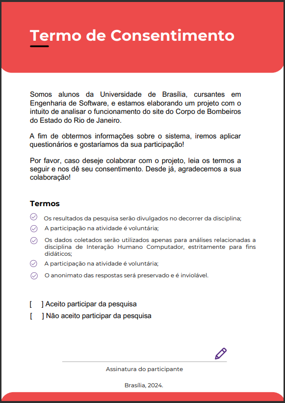

## Introdução

 Levar em consideração os aspectos éticos ao realizar uma pesquisa é fundamental para a proteção dos direitos e para o bem-estar daqueles que participarão da pesquisa. Além disso, a integridade ética é um pilar primordial para assegurar a confiança do público na pesquisa, garantindo a validade e a credibilidade dos resultados obtidos. Dentre as boas práticas que devem ser adotadas em uma pesquisa, temos: 

- Buscar conhecer os críterios de conduta adequados;
- Obter consentimento informado dos participantes;
- Garantir confidencialidade aos participantes;
- Divulgar os resultados com resposabilidade; 
- Ser transparente sobre métodos e procedimentos da pesquisa. 

## Termo de consetimento

 O modelo do termo de consentimento está ilustrado abaixo (Figura 1):  

 
*Figura 1 - Termo de consentimento.*  

## Bibliografia
> 1. ACADÊMICA. <strong>Ética em pesquisa - Pesquisa na Prática #20. </strong> YouTube, 13 de agosto de 2019. Disponível em: <<https://www.youtube.com/watch?v=uApu0Eg1brY>>. Acesso em: 17 de abr. de 2024.

## Histórico de Versões

| Versão |    Data    | Descrição                                 | Autor(es)                                       | Revisor(es)                                    |
| ------ | :--------: | ----------------------------------------- | ----------------------------------------------- | ---------------------------------------------- |
| `1.0`   | 16/04/2024 | Criação da página                         | [Mariana Letícia](https://github.com/Marianannn) | [Daniela Alarcão](https://github.com/danialarcao)         |
| `2.0`   | 17/04/2024 | Adição de conteúdo e envio ao git pages                        | [Daniela Alarcão](https://github.com/danialarcao) | [Mariana Letícia](https://github.com/Marianannn)         |
