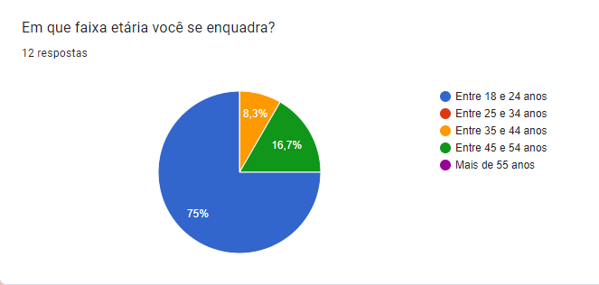
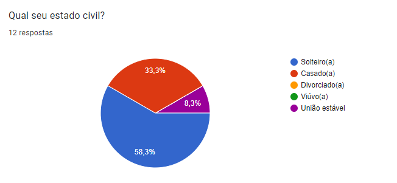
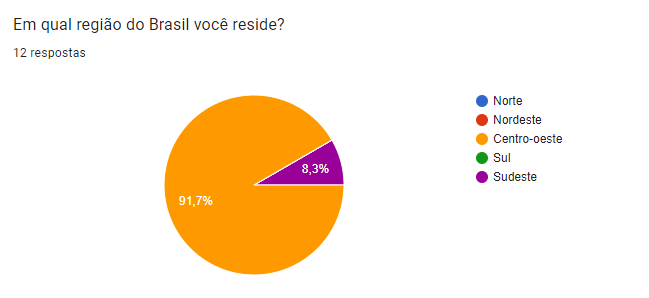
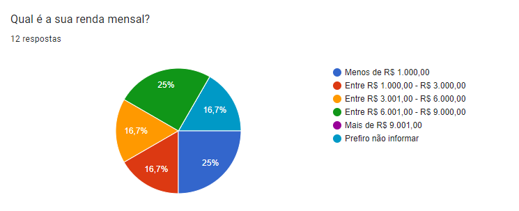
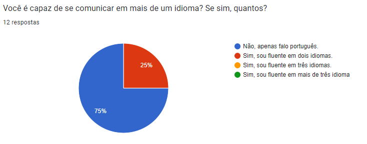
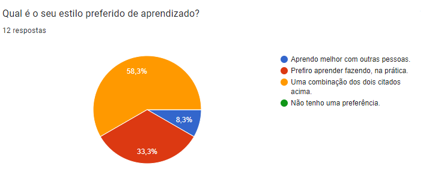
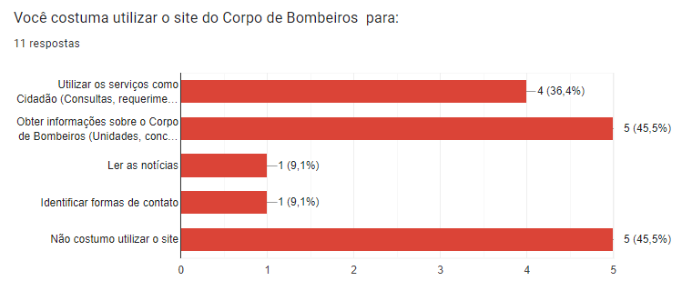
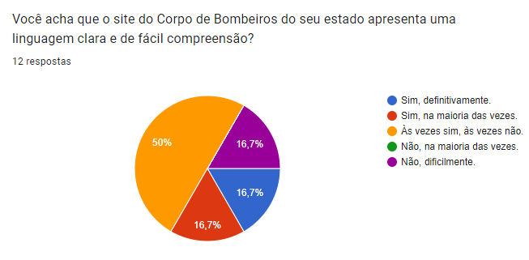

## Introdução
No desenvolvimento de um produto de qualidade, compreender quem são os seus usuários é a atividade mais essencial (Courage e Baxter, 2005; Hackos e Redish, 1998). Nesse contexto, a análise do perfil dos usuários desempenha um papel crucial. Por meio dessa investigação, podemos documentar e compreender o que os usuários reais ou potenciais realmente precisam. A seguir, apresentamos o processo de identificação do perfil dos usuários para o projeto, explorando as técnicas utilizadas e os insights obtidos ao longo do processo.

## Metodologia
A construção do perfil de usuário do Corpo de Bombeiros envolveu a aplicação de duas técnicas distintas: aplicação de questionários e grupo de foco. A seguir, descreveremos cada uma dessas abordagens e como as implementamos.

### Questionários
Um questionário é composto por uma série de perguntas, geralmente disponibilizado em versão impressa ou online, que tem como objetivo coletar informações essenciais por meio das respostas fornecidas pelos participantes.

Para construir o questionário utilizado, elaboramos um total de x questões, abordando diversos aspectos relacionados ao próprio usuário e sua interação com a tecnologia. O questionário foi distribuído para uma ampla variedade de públicos, considerando que o site em questão é acessível a todos os cidadãos. Essa abordagem visou obter uma amostra diversificada e representativa, com o objetivo de garantir a maior riqueza de dados possíveis.

### Vantagens
- Analisar os dados coletados pode ser relativamente mais fácil e rápido;
- É uma técnica econômica, pois requer pouco esforço de distribuição;
- Permite obter informações de um grande número de pessoas de forma mais prática;
- São úteis quando o público-alvo está espalhado em áreas geográficas distintas.

### Desvantagens
- Pode haver uma baixa taxa de resposta;
- É necessário ter cuidado com perguntas que tenham a resposta embutida ou que sejam muito restritivas, pois isso pode fazer com que as pessoas não expressem realmente o que pensam;
- Questões complexas ou que requerem explicações detalhadas podem não ser adequadas para questionários, dificultando a obtenção de informações profundas sobre certos tópicos.

## Resultados coletados

### 1. Faixa etária

Figura 1 - Gráfico (Faixa etária). 

### 2. Gênero

Figura 2 - Gráfico (Gênero). 

### 3. Estado civil

Figura 3 - Gráfico (Estado Civil). 

### 4. Escolaridade

Figura 4 - Gráfico (Escolaridade). 

### 5. Região

Figura 5 - Gráfico (Região). 

### 6. Renda

Figura 6 - Gráfico (Renda) 

### 7. Idiomas

Figura 7 - Gráfico (Idiomas) 

### 8. Estilo de aprendizado

Figura 8 - Gráfico (Estilo preferido de aprendizado) 

### 9. Frequência de leitura

Figura 9 - Gráfico (Frequência de leitura). 

### 10. Facilidade com tecnologia

Figura 10 - Gráfico (Facilidade com Tecnologia). 

### 11. Frequência de uso

Figura 11 - Gráfico (Frequência de uso do site). 

### 12 . Utilização do site

Figura 12 - Gráfico de Faixa etária. 

### 13. Linguagem e clareza

Figura 13 - Gráfico (Clareza da linguagem do site). 

### 14. Ferramentas utilizadas

Figura 14 - Gráfico (Ferramentas do site). 

### 15. Erros no site
Respostas obtidas em relação aos erros encontradas no site:

Figura 15 - Pergunta 1 (Erros) 

 
 ### 16. Sugestões
 Respostas obtidas em relação as sugestões de melhoria do site:

Figura 16 - Pergunta 2 (Sugestões) 

### Grupo de Foco
Um grupo de foco é uma ténica de pesquisa que normalmente reune 3 à 10 pessoas para discutir algum ponto em relação ao projeto. Assim, esses participantes representam o público-alvo do produto e são selecionados pensando em forma de obter diversidade de perspectivas e experiências.

Desta maneira, para realizarmos o grupo de foco foi necessário reunir usuários que compõe o público-alvo em uma entrevista guiada por um moderador que desenvolveu antecipadamente perguntas para conduzir a discussão de forma adequada. 

### Vantagens
- Permite coletar informações de um público-alvo que não conhecemos bem;
- Permite obter perspectivas de diferentes pontos de vistas em pouco tempo;
- A interação frequente entre os participantes pode gerar discussões e ideias.
### Desvantagens
- O recrutamento de usuários que compõe o grupo pode ser uma tarefa complicada que demanda muitos recursos.

## Resultados coletados

## Análise dos resultados

## Bibliografia
> 1. Barbosa, S. D. J.; Silva, B. S. da; Silveira, M. S.; Gasparini, I.; Darin, T.; Barbosa, G. D. J. Interação Humano-Computador e Experiência do usuário. (2021)

## Histórico de Versões

| Versão |    Data    | Descrição                                 | Autor(es)                                       | Revisor(es)                                    |
| ------ | :--------: | ----------------------------------------- | ----------------------------------------------- | ---------------------------------------------- |
| `1.0`   | 16/04/2024 | Criação da página                         | [Mariana Letícia](https://github.com/Marianannn) |    [Bruna Lima](https://github.com/libruna)      |
| `1.1`   | 19/04/2024 | Inclusão da introdução e metodologia                       |  [Bruna Lima](https://github.com/libruna) |             [Genilson Silva](https://github.com/GenilsonJrs)      | |
| `1.2`   | 22/04/2024 | Inclusão do resultado dos questionários e descrição do grupo de foco                  |  [Pedro Henrique](https://github.com/PedroHhenriq) |             [Genilson Silva](https://github.com/GenilsonJrs)      | |
