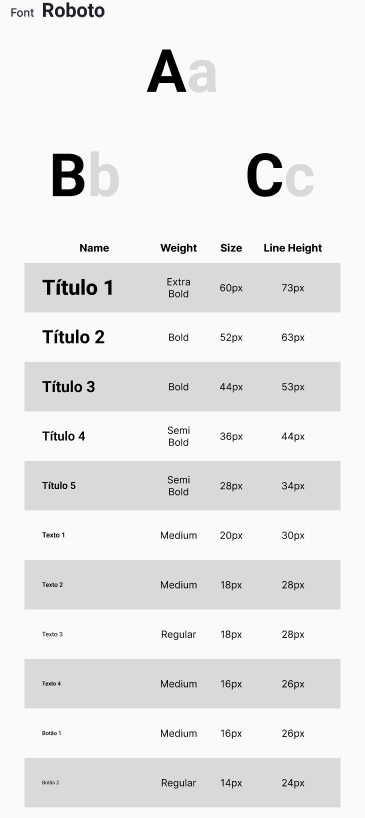

## Introdução

O guia de estilo, como destacado por Barbosa e Silva (2011), desempenha um papel vital como um registro consolidado das decisões de design, garantindo que sejam integradas de forma eficaz ao produto final. Ele funciona como um canal de comunicação essencial entre os membros da equipe e os stakeholders, facilitando consultas e discussões para futuras atualizações e projeções. 

## Objetivo do Guia de Estilo

Ao incorporar elementos como layout, tipografia, simbolismo, cores, visualização de informação e design de telas, o guia busca assegurar uma abordagem uniforme, coerente e agradável em toda a interface do sistema. Essa abordagem não só promove a clareza e consistência visual, mas também visa atender às necessidades e expectativas específicas dos usuários do site.   Portanto, este guia de estilo emerge como um recurso fundamental para orientar o desenvolvimento de interfaces, sendo destinado a designers e desenvolvedores envolvidos na criação e manutenção da interface dos usuários do site do Corpo de Bombeiros do Rio de Janeiro.

## Como utilizar o Guia de Estilo

Este guia de estilo foi desenvolvido para ser utilizado como uma referência ao longo de todo o ciclo de vida do projeto de Interação Humano-Computador, abrangendo desde o seu  desenvolvimento até a sua manutenção. Ele oferece diretrizes claras para elementos de design como layout, tipografia, simbolismo e cores, garantindo consistência na interface. Durante a produção, ajuda a manter a coesão visual e facilita a colaboração da equipe. Na manutenção, permite ajustes mantendo a integridade do design. 
 

### Como manter o Guia de Estilo

A manutenção contínua do guia de estilo é um processo dinâmico e colaborativo, essencial para manter a coerência visual e de interação em todo o sistema. Para isso, recomenda-se que, sempre que a equipe tomar decisões que afetem o projeto, seja através de modificações na interface ou na interação, o guia seja imediatamente atualizado para refletir essas mudanças. Além disso, recomenda-se que, sempre que possível, sejam incluídos exemplos visuais para ilustrar as diretrizes de design, ajudando a equipe a entender melhor como aplicá-las na prática. 

## Elementos de Interface e Interação

Diante da importância do Guia de estilo e sua organização, está presente abaixo elementos de interface, interação e ação presentes no site.

### Logos

### Cores

### Elementos de Interface

### Estilo das Opções

### Ícones

### Janela Inicial

### Tipografia

Os elementos de um site consistem nos diversos componentes visuais e funcionais que compõem sua estrutura e funcionalidade. Isso inclui elementos de interface, como menus de navegação, botões, campos de formulário e barras laterais, bem como elementos de conteúdo, como texto, imagens e vídeos. Cada elemento desempenha um papel específico na experiência do usuário e na interação com o site, contribuindo para a facilidade de uso, acessibilidade e eficácia geral do design.

## Vocabulário e padrões

<strong>- Terminologia:</strong> As terminologias devem ser familiares aos usuários, evitando termos muito técnicos. Se algum termo técnico for usado, é importante o fornecimento de explicações simples de quaisquer forma para que até os usuários iniciantes possam entender e utilizar a aplicação de forma intuitiva como previsto.

<strong>- Tipos de tela:</strong> As telas devem seguir padrões de cores e elementos simples de forma a facilitar a visualização e prosseguimento mesmo em tarefas distintas.

<strong>- Sequências de diálogos:</strong> As sequências de diálogos devem ser padronizadas, conforme especificado nos elementos de interação, garantindo que sempre fiquem disponíveis botões de prosseguimento, geração e/ou retorno.

## Referências Bibliográficas
> 1. BARBOSA, S. D. J.; SILVA, B. S. Interação Humano-Computador. Rio de Janeiro: Elsevier, 2011.
> 2. Guia de Estilos BI. (04/2016). Universidade de Brasília.

## Histórico de Versões

| Versão |    Data    | Descrição                                 | Autor(es)                                       | Revisor(es)                                    |
| ------ | :--------: | ----------------------------------------- | ----------------------------------------------- | ---------------------------------------------- |
| 1.0   | 07/05/2024 | Criação da página                         | [Mariana Letícia](https://github.com/Marianannn) | [Lucas Avelar](https://github.com/LucasAvelar2711)        |
| 2.0   | 12/05/2024 | Criação de tópicos e adição de conteúdo                        | [Daniela Alarcão](https://github.com/danialarcao) | [Lucas Avelar](https://github.com/LucasAvelar2711)        |
| 3.0   | 13/05/2024 | Criação do Figma e tópicos                    | [Genilson Junior](https://github.com/GenilsonJrs) | [Lucas Avelar](https://github.com/LucasAvelar2711)        |
| 4.0   | 04/07/2024 | Remoção do Figma para melhor disposição de imagens                    | [Daniela Alarcão](https://github.com/danialarcao) | [Lucas Avelar](https://github.com/LucasAvelar2711)        |
