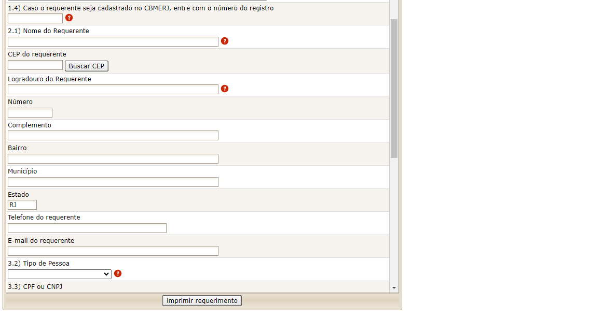
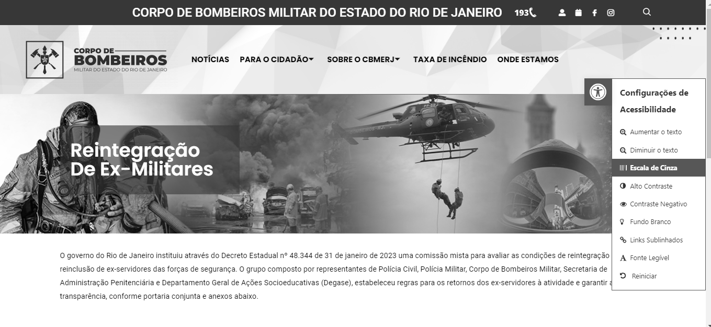

## Introdução
Os princípios e diretrizes gerais orientam o processo de criação de interfaces que sejam intuitivas para os usuários. De acordo com Norman (1988), o design deve simplificar a determinação das ações possíveis em cada momento, utilizando restrições. Além disso, destaca que é importante tornar visíveis as alternativas de ação e seus resultados; avaliar o estado atual do sistema e estabelecer mapeamentos naturais entre intenções, ações e resultados. Os princípios e as diretrizes abrangem os tópicos: correspondência com as expectativas dos usuários, simplicidade nas estruturas das tarefas, equilíbrio entre controle e liberdade do usuário, consistência e padronização, promoção da eficiência do usuário, antecipação das necessidades do usuário, visibilidade e reconhecimento, conteúdo relevante e expressão adequada, e projeto para erros.

## Metodologia
Após revisão dos princípios e diretrizes gerais, realizamos uma análise do site do Corpo de Bombeiros do Rio de Janeiro para determinar quais princípios seriam aplicáveis. Como resultado, identificamos os princípios abaixo, levando em consideração o contexto do sistema e a viabilidade de implementação.

## Princípios aplicáveis

### 1. Correspondência com as expectativas dos usuários
**Definição:**
**Análise:**
  
### 2. Simplicidade nas estruturas das tarefas
**Definição:**
**Análise:**
  
### 3. Equilíbrio entre controle e liberdade do usuário
**Definição:**
**Análise:**
  
### 4. Consistência e padronização
**Definição:**
**Análise:**
  
### 5. Promovendo a eficiência do usuário
**Definição:**
**Análise:**
  
### 6. Antecipação das necessidades do usuário
**Definição:** Busca prever as necessidades do usuário antes mesmo que ele as expresse, isso envolve fornecer informações e ferramentas relevantes em cada etapa do processo. As estratégias incluem oferecer informações adicionais úteis e lembrar das ações do usuário para facilitar sua execução. A definição cuidadosa de valores padrão também é destacada, considerando que os usuários frequentemente aceitam os padrões sem questionar.
**Análise:** Há recursos que antecipam as necessidades do usuário, prevendo situações comuns. Por exemplo, na figura 6, são oferecidos recursos de ajuda durante o preenchimento de campos, facilitando a compreensão. Além disso, na figura 7, observamos o uso de valores padrão nos campos, o que também contribui para antecipar as ações do usuário.

Figura 6 - Recurso de ajuda em formulário de Solicitação de Requimento Padrão (Fonte: Site do Corpo de Bombeiros do Rio de Janeiro).

Figura 7 - Campo default em formulário de Solicitação de Requimento Padrão (Fonte: Site do Corpo de Bombeiros do Rio de Janeiro).

### 7. Visibilidade e reconhecimento
**Definição:** Busca tornar claro o que é possível realizar e o estado do sistema antes e após as ações do usuário. As estratégias incluem oferecer feedback adequado e oportuno, manter o usuário informado sobre seu progresso e facilitar a navegação, evitando sobrecarregá-lo com informações desnecessárias.

**Análise:** 
Ao acessar o site, percebemos imediatamente o menu bem estruturado, organizado em seções que facilitam a navegação. Ao escolher uma seção, como exemplificado na Figura 8 com "Emissão de Boletos", o usuário é direcionado diretamente ao formulário correspondente, agilizando a interação. De modo geral, a interface transmite clareza em relação aos estados e ações disponíveis.

Figura 8 - Formulário para Emissão de Boleto (Fonte: Site do Corpo de Bombeiros do Rio de Janeiro).

  
### 8. Conteúdo relevante e expressão adequada
**Definição:** Enfatiza a importância de oferecer informações pertinentes e redigir textos de forma clara e concisa nas interfaces. Isso inclui evitar o excesso de informação, utilizar linguagem simples e direta, além de garantir legibilidade e acessibilidade para todos os usuários. É crucial que o conteúdo apresentado seja relevante para as necessidades dos usuários e que a expressão seja adequada ao contexto da interação.

**Análise:** No geral, o site mantém um padrão consistente durante a navegação, com textos claros que comunicam eficazmente seus propósitos. Um exemplo disso pode ser visto na figura 9, onde os menus estão localizados, apresentando opções organizadas e categorizadas de forma precisa.

Figura 9 - Opções do menu (Fonte: Site do Corpo de Bombeiros do Rio de Janeiro).

Por outro lado, na figura 10, observamos que embora haja opções de acessibilidade, ao selecioná-las, elas se aplicam apenas à página atual. Ao navegar para outras páginas, o site retorna às configurações padrão, o que pode dificultar a experiência de usuários que dependem dessas opções.

Figura 10 - Opções de acessibilidade (Fonte: Site do Corpo de Bombeiros do Rio de Janeiro).

### 9. Projeto para erros
**Definição:** Envolve antecipar e facilitar a recuperação de erros por parte do usuário. isso inclui projetar sistemas exploráveis, onde é fácil reverter operações e difícil realizar ações irreversíveis. Recomenda-se evitar erros sempre que possível e, caso ocorram, o sistema deve detectá-los e oferecer mecanismos simples para tratá-los. As mensagens de erro devem ser claras, indicando o problema e sugerindo uma solução construtiva. Além disso, é importante oferecer ajuda e documentação de alta qualidade para esclarecer dúvidas dos usuários durante a interação.

**Análise:** Ao tentar imprimir o requerimento padrão sem preencher alguns campos, um aviso de erro é exibido. No entanto, a mensagem sobre o motivo do erro não é clara, apenas uma mensagem de erro interno do sistema é exibida na tela sem que seja previamente tratada para compreensão do usuário, como mostrado na figura 11.

Figura 11 - Erro ao imprimir Requerimento Padrão (Fonte: Site do Corpo de Bombeiros do Rio de Janeiro).

## Bibliografia
> 1. Barbosa, S. D. J.; Silva, B. S. da; Silveira, M. S.; Gasparini, I.; Darin, T.; Barbosa, G. D. J. Interação Humano-Computador e Experiência do usuário. (2021)

## Histórico de Versões

| Versão |    Data    | Descrição                                 | Autor(es)                                       | Revisor(es)                                    |
| ------ | :--------: | ----------------------------------------- | ----------------------------------------------- | ---------------------------------------------- |
| `1.0`   | 07/05/2024 | Criação da página                         | [Mariana Letícia](https://github.com/Marianannn) |   [Bruna Lima](https://github.com/libruna)  |
| `1.1`   | 11/05/2024 | Adição da introdução e metodologia        | [Bruna Lima](https://github.com/libruna)         |      |
| `1.2`   | 12/05/2024 | Adição dos princícios                     | [Bruna Lima](https://github.com/libruna)         |      |
