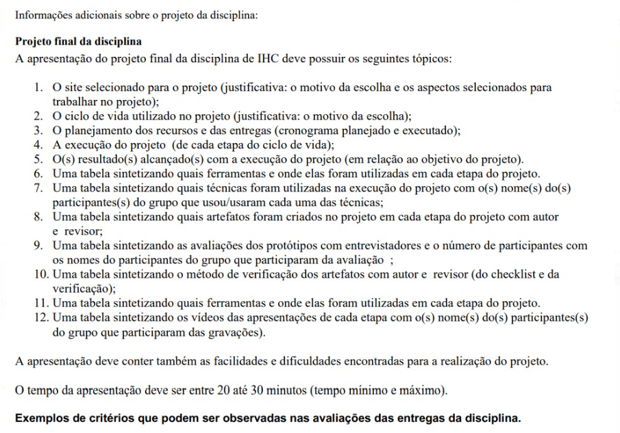

<h1 align="center"> Ata 7 </h1>

**Redator(a):** Bruna Lima

## Data/Horário

Segue abaixo na tabela 1, informações sobre a data, horário e local onde ocorreu a reunião 1:

| Data       | Horário | Local           |
| :--------: | :-----: |:--------------: |
| 03/07/2024 | 23:37   | Microsoft Teams             |

**Tabela 1:** Data, horário e local da reunião realizada.  
**Fonte:** Mariana Letícia, 2024.

## Participantes

Segue abaixo na Tabela 2, informações sobre quais participantes estiveram presentes na reunião:

**Tabela 2:**  tabela de participantes.

| Participantes | Presentes na reunião 
| :-----------: | :----------------------: 
| [Bruna Lima](https://github.com/libruna) | sim
| [Daniela Alarcão](https://github.com/danialarcao) | sim
| [Genilson Silva](https://github.com/GenilsonJrs) | sim
| [Lucas Avelar](https://github.com/LucasAvelar2711)| sim
| [Mariana Letícia](https://github.com/Marianannn) | sim
| [Pedro Henrique](https://github.com/https://github.com/PedroHhenriq) | sim

**Tabela 2:** Lista de participantes da reunião.  
**Fonte:** Mariana Letícia, 2024.

## Pautas

- Planejamento da execução das tarefas da etapa final;

## Assuntos tratados

### Apresentação

- Foram apresentadas as pautas;

### Definição

#### Definição do cronograma de atividades da etapa

- Seguindo os seguintes artefatos representados na imagem 1 acima, fizemos a seguinte decisão(do lado esquerdo há o número do artefato que a pessoa será responsável e do lado direito há a pessoa responsável pelo artefato):
    - 1 e 2 - Bruna
    - 3 e 4 - Mariana
    - 5 e 6 - Genilson
    - 7 e 8 - Lucas
    - 9 e 10 - Daniela
    - 11 e 12 - Pedro

## Gravação da Reunião
Segue abaixo a reunião gravada no vídeo 1:

<iframe width="1000vw" height="400vh" src="https://www.youtube.com/embed/TkQD18sESpM?si=-3cZ87x80aQHggiR" title="YouTube video player" frameborder="0" allow="accelerometer; autoplay; clipboard-write; encrypted-media; gyroscope; picture-in-picture; web-share" referrerpolicy="strict-origin-when-cross-origin" allowfullscreen></iframe>

**Vídeo 1:** Reunião final IHC (fonte: Mariana Letícia, 2024)

## Próxima reunião

Não planejamos próxima reunião pois esta, em tese, seria a última.

## Histórico de Versões

| Versão |    Data    | Descrição                                 | Autor(es)                                       | Revisor(es)                                    |
| ------ | :--------: | ----------------------------------------- | ----------------------------------------------- | ---------------------------------------------- |
| `1.0`   | 13/06/2024 | Criação da ata | [Mariana Letícia](https://github.com/https://github.com/Marianannn) | [Bruna Lima](https://github.com/https://github.com/libruna)| 
| `1.1`   | 08/07/2024 | Correções e adição de fontes | [Bruna Lima](https://github.com/libruna) |  | 

