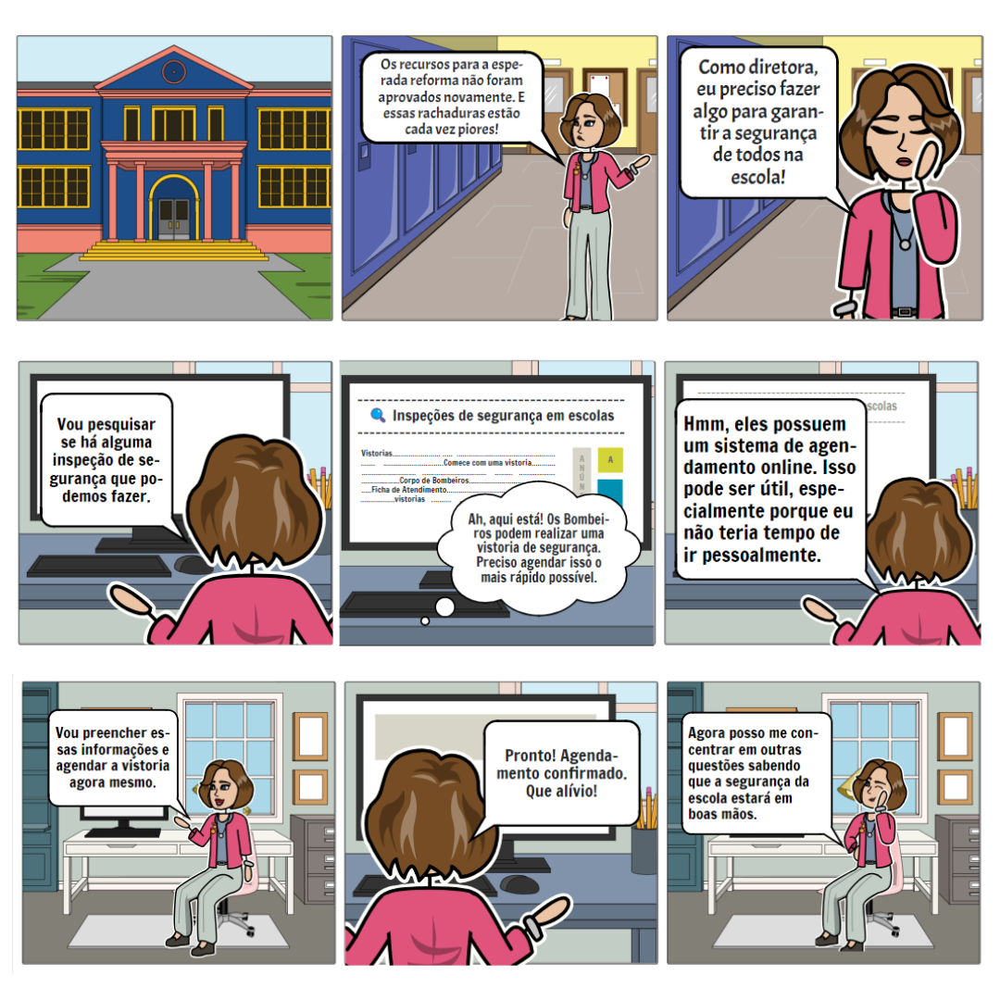
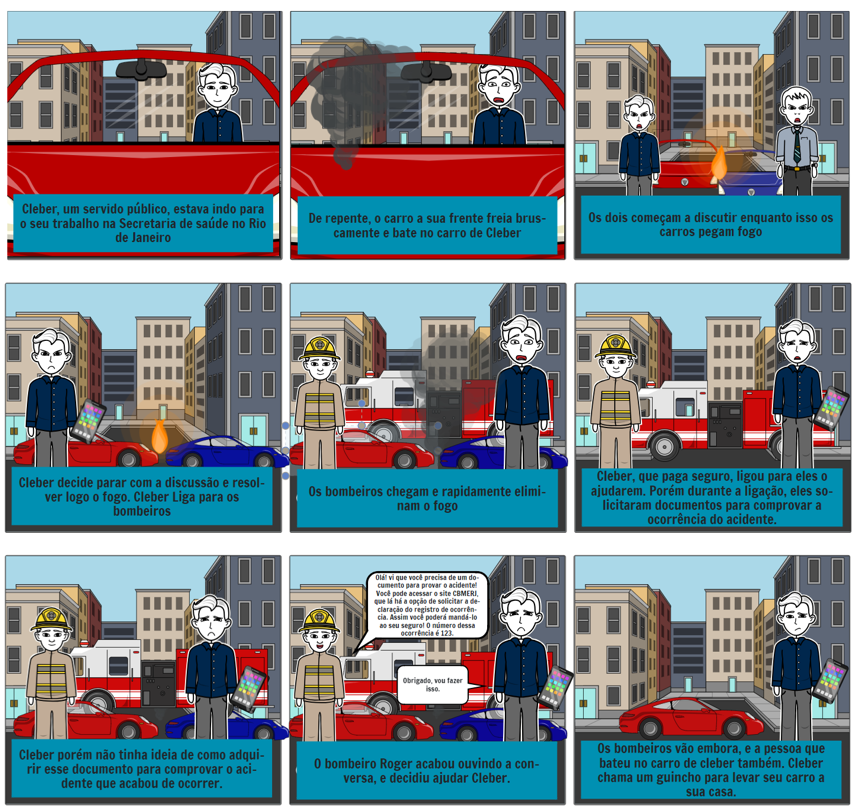

## Introdução

## Metodologia 

<!-- Documentaremos aqui os storyboards de cada uma das funcionalidades analisadas -->

### 1. Solicitação de Ficha de Atendimento
O storyboard da funcionalidade de Solicitação de Ficha de Atendimento foi inicialmente esboçado à mão e posteriormente produzido e aprimorado com o auxílio da ferramenta do [Storyboard That](https://www.storyboardthat.com/pt/).

Figura 1 - Storyboard da funcionalidade de "Solicitação de Ficha de Atendimento" (Fonte: Bruna Lima, 2024). 

### 2. Obter declaração de registro de ocorrência
O storyboard da funcionalidade de obter declaração de registro de ocorrência foi feito à mão e depois melhorado com o auxílio da ferramenta do [Storyboard That](https://www.storyboardthat.com/pt/).

Figura 1 - Storyboard da funcionalidade de "Solicitação de Ficha de Atendimento" (Fonte: Mariana Letícia, 2024). 

### 3. Agendamento de atendimento presencial
O storyboard da funcionalidade de agendamento de atendimento presencial foi feito à mão e depois melhorado com o auxílio da ferramenta do [Storyboard That](https://www.storyboardthat.com/pt/).

Figura 3 - Storyboard da funcionalidade de "Agendamento de Atendimento Presencial" (Fonte: Daniela Alarcão, 2024). 

### 4. Curso do Corpo de Bombeiros - Primeiro Socorros
O storyboard da funcionalidade "Curso do Corpo de Bombeiro - Primeiro Socorros" foi realizado à mão em um papel conforme pode ser identificado abaixo:

Figura 4 - Storyboard da funcionalidade de "Curso do Corpo de Bombeiros - Primeiro Socorros" (Fonte: Pedro Henrique, 2024). 

## Bibliografia

## Histórico de Versões

| Versão |    Data    | Descrição                                 | Autor(es)                                       | Revisor(es)                                    |
| ------ | :--------: | ----------------------------------------- | ----------------------------------------------- | ---------------------------------------------- |
| `1.0`   | 16/05/2024 | Criação da página                         | [Mariana Letícia](https://github.com/Marianannn) |  [Bruna Lima](https://github.com/libruna)   |
| `1.2`   | 19/05/2024 | Adição do storyboard da funcionalidade de ficha de atendimento                       | [Bruna Lima](https://github.com/libruna) |   |
| `1.3`   | 20/05/2024 | Adição do storyboard da funcionalidade de Obter declaração de registro de ocorrência                        | [Mariana Letícia](https://github.com/Marianannn) |   |
| `1.4`   | 22/05/2024 | Adição do storyboard da funcionalidade de agendamento de atendimento presencial                        | [Daniela Alarcão](https://github.com/danialarcao) |   |
| `1.5`   | 22/05/2024 | Adição do storyboard Curso do Corpo de Bombeiros - Primeiro Socorros | [Pedro Henrique](https://github.com/PedroHhenriq) |   |