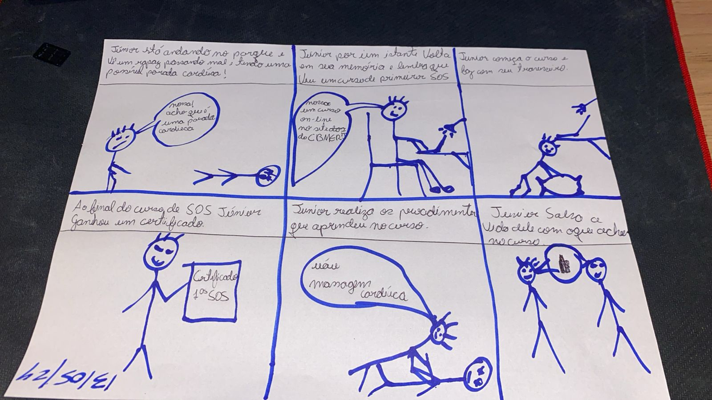

## Introdução
A tradução de "story" significa história e "board" significa quadro. O Storyboard é uma técnica que utiliza uma sequência de desenhos ou ilustrações que representam estados da interface ao longo do caminho de interação do cliente com o sistema, é como um roteiro desenhado. (1)

## Metodologia 

### 1. Solicitação de Ficha de Atendimento
O storyboard da funcionalidade de Solicitação de Ficha de Atendimento apresentado na figura 1 foi inicialmente esboçado à mão e posteriormente produzido e aprimorado com o auxílio da ferramenta do [Storyboard That](https://www.storyboardthat.com/pt/).

Figura 1 - Storyboard da funcionalidade de "Solicitação de Ficha de Atendimento" (Fonte: Bruna Lima, 2024). 

### 2. Obter declaração de registro de ocorrência
O storyboard da funcionalidade de obter declaração de registro de ocorrência apresentado na figura 2 foi feito à mão e depois melhorado com o auxílio da ferramenta do [Storyboard That](https://www.storyboardthat.com/pt/).

Figura 2 - Storyboard da funcionalidade de "Solicitação de Ficha de Atendimento" (Fonte: Mariana Letícia, 2024). 

### 3. Agendamento de atendimento presencial
O storyboard da funcionalidade de agendamento de atendimento presencial apresentado na figura 3 foi feito à mão e depois melhorado com o auxílio da ferramenta [Canva](https://www.canva.com/).

Figura 3 - Storyboard da funcionalidade de "Agendamento de Atendimento Presencial" (Fonte: Daniela Alarcão, 2024). 

### 4. Curso do Corpo de Bombeiros - Primeiro Socorros
O storyboard da funcionalidade "Curso do Corpo de Bombeiros - Primeiros Socorros" apresentado na figura 4 foi realizado à mão em um papel conforme pode ser identificado abaixo:

Figura 4 - Storyboard da funcionalidade de "Curso do Corpo de Bombeiros - Primeiro Socorros" (Fonte: Pedro Henrique, 2024). 

### 5. Curso do Corpo de Bombeiros 2 - Primeiro Socorros
O storyboard da funcionalidade "Curso do Corpo de Bombeiros 2 - Primeiros Socorros" apresentado na figura 5 foi realizado à mão em um papel conforme pode ser identificado abaixo:

Figura 5 - Storyboard da funcionalidade de "Curso do Corpo de Bombeiros - Primeiros Socorros" (Fonte: Lucas Avelar, 2024). 

## Referências Bibliográficas
1. Storyboarding e Prototipação, disponível em: https://www.professores.uff.br/screspo/wp-content/uploads/sites/127/2017/09/artigoIHC3.pdf
   
## Histórico de Versões

| Versão |    Data    | Descrição                                 | Autor(es)                                       | Revisor(es)                                    |
| ------ | :--------: | ----------------------------------------- | ----------------------------------------------- | ---------------------------------------------- |
| `1.0`   | 16/05/2024 | Criação da página                         | [Mariana Letícia](https://github.com/Marianannn) |  [Bruna Lima](https://github.com/libruna)   |
| `1.2`   | 19/05/2024 | Adição do storyboard da funcionalidade de ficha de atendimento                       | [Bruna Lima](https://github.com/libruna) | [Daniela Alarcão](https://github.com/danialarcao)  |
| `1.3`   | 20/05/2024 | Adição do storyboard da funcionalidade de Obter declaração de registro de ocorrência                    | [Mariana Letícia](https://github.com/Marianannn) | [Bruna Lima](https://github.com/libruna)  |
| `1.4`   | 22/05/2024 | Adição do storyboard da funcionalidade de agendamento de atendimento presencial                        | [Daniela Alarcão](https://github.com/danialarcao) | [Bruna Lima](https://github.com/libruna)  |
| `1.5`   | 22/05/2024 | Adição do storyboard Curso do Corpo de Bombeiros - Primeiro Socorros | [Pedro Henrique](https://github.com/PedroHhenriq) |  [Bruna Lima](https://github.com/libruna) |
| `1.6`   | 22/05/2024 | Adição do storyboard do Curso do Corpo de Bombeiros 2 - Primeiro Socorros | [Lucas Avelar](https://github.com/LucasAvelar2711)  | [Daniela Alarcão](https://github.com/danialarcao) |
