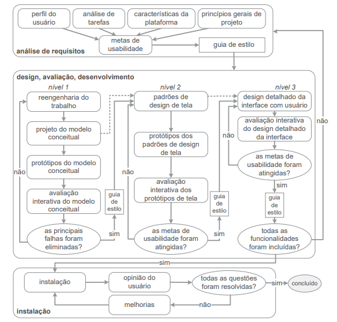

## Introdução
Os processos de design detalham atividades específicas que guiam desde a compreensão inicial das necessidades até a implementação e avaliação das soluções propostas. Isso envolve a análise da situação atual para interpretar o contexto, a síntese de intervenção para planejar e executar mudanças, e a avaliação da nova situação para comparar os resultados obtidos. A seguir, apresentamos o ciclo de vida utilizado.

## Metodologia
O grupo se reuniu e discutiu os principais ciclos de vida, considerando também as sugestões do professor. Após debate, adotamos o Ciclo de Dida de Mayhew apresentado na Figura 1 para guiar o desenvolvimento do projeto.

**Figura 1:** Ciclo de vida de Mayhew.  
**Fonte:** Barbosa e Silva (2021).

## Escolha do método
Optamos pelo Ciclo de Vida de Mayhew por alguns motivos:

- Oferece um processo robusto e iterativo, adequado para guiar o desenvolvimento de soluções interativas.
- É recomendado para equipes inexperientes, fornecendo uma estrutura clara e passos bem definidos.
- Organiza diversas atividades de Interação Humano-Computador (IHC), proporcionando uma orientação eficaz para o trabalho de design.

Assim, o planejamento do projeto foi estruturado com base nas etapas de Análise de Requisitos, Design, Avaliação e Desenvolvimento do Ciclo de Vida de Mayhew.

Ao adotar esse método, conseguimos ter uma compreensão mais clara de todas as etapas do processo e da aplicação das atividades de IHC, o que foi fundamental para aprendizado de todo o grupo.

## Bibliografia
> - Barbosa, S. D. J.; Silva, B. S. da; Silveira, M. S.; Gasparini, I.; Darin, T.; Barbosa, G. D. J. Interação Humano-Computador e Experiência do usuário. (2021).

## Histórico de Versões

| Versão  | Data       | Descrição                 | Autor(es)                                | Revisor(es)                                    |
| ------- | :--------: | ------------------------- | ---------------------------------------- | ---------------------------------------------- |
| `1.0`   | 04/07/2024 | Criação da página         | [Bruna Lima](https://github.com/libruna) | |
| `2.0`   | 07/07/2024 | Adição do ciclo de vida utilizado | [Bruna Lima](https://github.com/libruna) | |