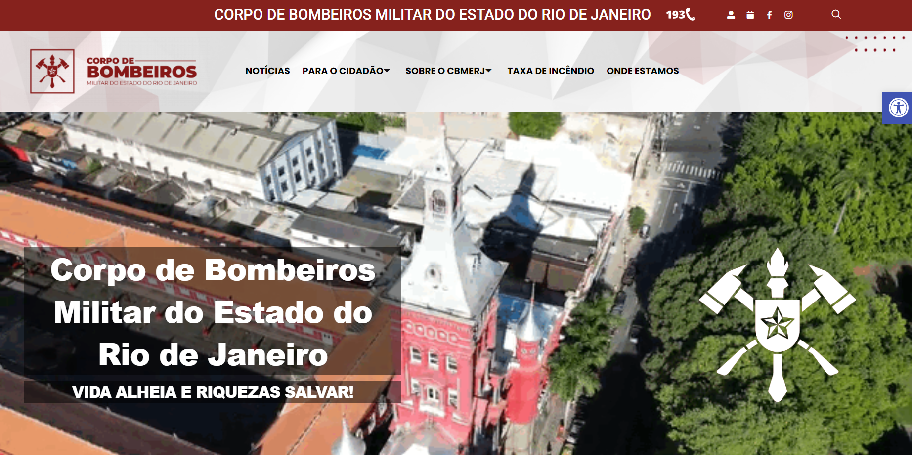

## Introdução

Este projeto é resultado do trabalho coletivo dos integrantes do Grupo 7 da disciplina Interação Humano-Computador da Universidade de Brasília. Nosso objetivo foi desenvolver uma análise detalhada do site do Corpo de Bombeiros do Estado do Rio de Janeiro, aplicando os princípios e metodologias de IHC. Durante o desenvolvimento, de acordo com o livro Interação Humano-Computador (Barbosa, Silva, 2010), conduzimos pesquisas, criamos protótipos de baixa e alta fidelidade, elaboramos storyboards e diagramas, realizamos entrevistas e implementamos diversas melhorias e funcionalidades no site, visando aprimorar sua usabilidade e funcionalidade.

## Objetivos

O objetivo principal deste projeto foi avaliar e melhorar as funcionalidades do site do Corpo de Bombeiros do Estado do Rio de Janeiro, utilizando as metodologias de Interação Humano-Computador (IHC). Cada membro do grupo escolheu uma funcionalidade específica para aprimorar ou criar, totalizando seis melhorias. Além de proporcionar melhorias tangíveis ao site, o projeto visou ensinar, na prática, as diversas metodologias e técnicas de IHC, facilitando a aprendizagem colaborativa e aplicada dos conceitos teóricos da disciplina.

## Resultados
Diante das etapas do projeto, todos os membros participaram ativamente, aplicando metodologias de IHC, ferramentas apropriadas e realizando correções necessárias ao longo das etapas. Durante o processo, foram contornados erros visuais e funcionais dos storyboards, diagramas, e da propria interface funcional, resultando em um produto viável conforme a metodologia utilizada. A observação de todo o percurso permitiu um aprendizado significativo, reforçando as práticas e conceitos estudados.

## Conclusão
Através da aplicação rigorosa da metodologia de Interação Humano-Computador, conseguimos extrair dados significativos e valiosos para o desenvolvimento do projeto. A metodologia permitiu a seleção de funcionalidades válidas e a identificação correta dos usuários-alvo para o site do Corpo de Bombeiros do Estado do Rio de Janeiro. Desenvolvemos estratégias eficazes para implementar testes, como o uso de protótipos de papel, que permitiram a coleta de dados e a identificação de erros antes de avançar para protótipos de alta fidelidade. Este processo não apenas reduziu custos, mas também garantiu a viabilidade do projeto.

O trabalho em grupo foi fundamental para a realização de entrevistas, storyboards, diagramas e a escolha de personas, o que nos permitiu ajustar e validar as funcionalidades com base em métodos bem fundamentados. Este projeto não só aprimorou nossas habilidades práticas e teóricas em IHC, mas também resultou em um produto final ajustado e adequado às necessidades dos usuários, alinhado com as melhores práticas do campo.

### Antes

  

Figura 1 - Tela Inicial CBMRJ (Fonte: Genilson Junior, 2024)

### Depois

  

Figura 2 - Tela Pós Ajustes CBMRJ (Fonte: Genilson Junior, 2024)  

## Referências
> - Barbosa, S. D. J.; Silva, B. S. da; Silveira, M. S.; Gasparini, I.; Darin, T.; Barbosa, G. D. J. Interação Humano-Computador e Experiência do usuário. (2021). Acesso em: 07 de julho de 2024.

## Histórico de Versões

| Versão  | Data       | Descrição                 | Autor(es)                                | Revisor(es)                                    |
| ------- | :--------: | ------------------------- | ---------------------------------------- | ---------------------------------------------- |
| `1.0`   | 04/07/2024 | Criação da página         | [Bruna Lima](https://github.com/libruna) |[Genilson Silva](https://github.com/GenilsonJrs) |
| `2.0`   | 07/07/2024 | Adição de Conteúdo         | [Genilson Silva](https://github.com/GenilsonJrs) | |