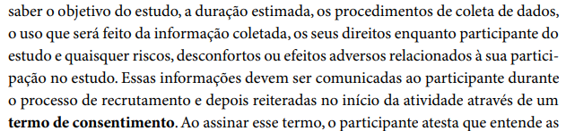
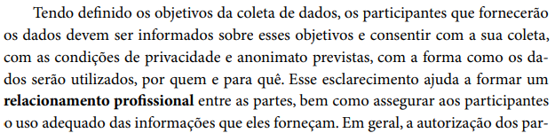

## Introdução
A verificação dos cenários é essencial para avaliar se eles refletem a realidade da funcionalidade e se podem ser aplicados em diferentes contextos.

## Metodologia
A metodologia utilizada foi a de inspeção por percurso cognitivo, conforme detalhado no [planejamento de verificação](../planejamento_verificacao.md). Este método de avaliação individual envolve a exploração da interface para identificar vários tipos de erros.

Iremos abordar um template de checklist que deverá ser preenchido bem como o modelo disposto em [planejamento de verificação](../planejamento_verificacao.md), devendo ser feita uma inspeção para cada artefato presente no projeto [Central expresso - Grupo 8](https://interacao-humano-computador.github.io/2024.1-Central-Expresso/).

### Participantes
O **avaliador** responsável por desenvolver a lista de verificação da etapa 2 sobre os aspectos éticos para o grupo 8 será a [Genilson Silva](https://github.com/GenilsonJrs), e a **revisora** será [Bruna Lima](https://github.com/libruna), conforme está evidente em [planejamento de verificação](../planejamento_verificacao.md).

### Template de Checklist: Cenários

- **Item 1:** O objetivo do estudo e como será conduzido está claramente definido?
    - **Fonte:**  Barbosa, Simone D. J. et al. Interação Humano-Computador e Experiência do Usuário. Autopublicação, 2021, p. 141
    - **Imagem:**  

    

    

    

    
Figura 1: Questionamento sobre objetivo do estudo conduzido

- **Item 2:** O termo de consentimento possui uma clara declaração de consentimento, informação sobre voluntariedade e definição de como os dados serão utilizados?
    - **Fonte:**  Barbosa, Simone D. J. et al. Interação Humano-Computador e Experiência do Usuário. Autopublicação, 2021, p. 133
    - **Imagem:**  

    

    

    

    
Figura 2: Questionamento sobre conteúdo do termo de consentimento

- **Item 3:** É citado procedimentos para proteger a privacidade dos dados coletados?
    - **Fonte:** Barbosa, Simone D. J. et al. Interação Humano-Computador e Experiência do Usuário. Autopublicação, 2021, p. 133
    - **Imagem:**  

    

    

    

    
Figura 3: Questionamento sobre a privacidade dos dados

- **Item 4:** O documento elicita e busca cumprir diante das diretrizes os principios da autonomia, beneficência, não maleficência, e justiça e equidade?
    - **Fonte:** Barbosa, Simone D. J. et al. Interação Humano-Computador e Experiência do Usuário. Autopublicação, 2021, p. 145
    - **Imagem:**  

    

    

    

    
Figura 4: Questionamento sobre citação e/ou cumprimento de princípios

### Resultado da Checklist:

## Biografia
>- Barbosa, E. F., & Souza, S. R. S. (2017). Inspeção de Software. Instituto de Ciências Matemáticas e de Computação — ICMC/USP. Disponivel em: https://edisciplinas.usp.br/pluginfile.php/5306452/mod_resource/content/0/Aula02-Inspecao.pdf
>- Serrano, M., & Serrano, M. (2017). Requisitos – Aula 23. Disponivel em: https://aprender3.unb.br/pluginfile.php/2843809/mod_resource/content/2/Requisitos%20-%20Aula%20023.pdf
>- Ministério da Agricultura, Pecuária e Abastecimento. (2023). Lista de Verificação da Qualidade de Artefatos - Checklist Ágil. Disponivel em: https://www.gov.br/agricultura/pt-br/acesso-a-informacao/licitacoes-e-contratos/edital/2019/pregao-eletronico-no-05-2018/diretrizes/lista-de-verificacao-da-qualidade-de-artefatos-checklist-agil.xls/view

## Referências Bibliográficas
> 1. Barbosa, Simone D. J. et al. Interação Humano-Computador e Experiência do Usuário. Autopublicação, 2021, p. 141.
> 2. Barbosa, Simone D. J. et al. Interação Humano-Computador e Experiência do Usuário. Autopublicação, 2021, p. 133.
> 3. Barbosa, Simone D. J. et al. Interação Humano-Computador e Experiência do Usuário. Autopublicação, 2021, p. 135.

## Histórico de Versões

| Versão |    Data    | Descrição                                 | Autor(es)                                       | Revisor(es)                                    |
| ------ | :--------: | ----------------------------------------- | ----------------------------------------------- | ---------------------------------------------- |
| `1.0`   | 12/06/2024 | Criação da página                         | [Genilson Silva](https://github.com/GenilsonJrs) |   |
| `2.0`   | 12/06/2024 | Adição do checklist                         | [Genilson Silva](https://github.com/GenilsonJrs) |   |