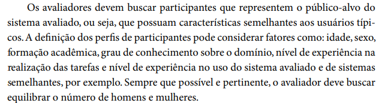

## Introdução
A verificação dos cenários é essencial para avaliar se eles refletem a realidade da funcionalidade e se podem ser aplicados em diferentes contextos.

## Metodologia
A metodologia utilizada foi a de inspeção por percurso cognitivo, conforme detalhado no [planejamento de verificação](../planejamento_verificacao.md). Este método de avaliação individual envolve a exploração da interface para identificar vários tipos de erros.

Iremos abordar um template de checklist que deverá ser preenchido bem como o modelo disposto em [planejamento de verificação](../planejamento_verificacao.md), devendo ser feita uma inspeção para cada artefato presente no projeto [Central expresso - Grupo 8](https://interacao-humano-computador.github.io/2024.1-Central-Expresso/).

### Participantes
O **avaliador** responsável por desenvolver a lista de verificação da etapa 2 sobre o perfil de usuário para o grupo 8 será a [Genilson Silva](https://github.com/GenilsonJrs), e a **revisora** será [Bruna Lima](https://github.com/libruna), conforme está evidente em [planejamento de verificação](../planejamento_verificacao.md).

### Template de Checklist: Cenários

- **Item 1:** O documento possui informações básicas demográficas como: Idade, Gênero, Escolaridade?
    - **Fonte:**  Barbosa, Simone D. J. et al. Interação Humano-Computador e Experiência do Usuário. Autopublicação, 2021, p. 134
    - **Imagem:**  

    

    

    

    
Figura 1: Questionamento sobre informações básicas a serem apresentadas

- **Item 2:** É especificado um contexto de uso? (Ambiente onde a pesquisa será realizada, equipamentos utilizados e forma de uso).
    - **Fonte:**  Barbosa, Simone D. J. et al. Interação Humano-Computador e Experiência do Usuário. Autopublicação, 2021, p. 187
    - **Imagem:**  

    

    

    

    
Figura 2: Questionamento sobre materiais e metodologia da pesquisa

- **Item 3:** Existe questionamento acerca de nível de experiência e preferências em relação a tecnologia?
    - **Fonte:** Barbosa, Simone D. J. et al. Interação Humano-Computador e Experiência do Usuário. Autopublicação, 2021, p. 305
    - **Imagem:**  

    

    

    

    
Figura 3: Questionamento experiência e preferencias quanto ao usuário

- **Item 4:** O documento possui preferências de interação, estilos e abertura para sugestões?
    - **Fonte:** Barbosa, Simone D. J. et al. Interação Humano-Computador e Experiência do Usuário. Autopublicação, 2021, p. 299
    - **Imagem:**  

    

    

    

    
Figura 4: Questionamento sobre abertura para preferências e demais comentários do usuário

### Resultado do Checklist

 

| Item | Descrição      | Versão do Artefato | Avaliação      | Descrição do problema | Sugestão de Ação Corretiva | Observações |
| ---- | -------------- | ------------------ | -------------- | --------------------- | -------------------------- | ----------- |
|  1   | O documento possui informações básicas demográficas como: Idade, Gênero, Escolaridade? | 1.0 | Conforme | | | O perfil contém todos esses itens. |
|  2   | É especificado um contexto de uso? | 1.0 | Conforme | | | A coleta de dados foi feita em grande maioria com estudantes da FGA por meio de questionários online. |
|  3   | Existe questionamento acerca de nível de experiência e preferências em relação a tecnologia? | 1.0 | Conforme | | | No questionário da pesquisa haviam perguntas para essa finalidade. | 
|  4   | O documento possui preferências de interação, estilos e abertura para sugestões? | 1.0 | Não conforme | De acordo com o documento, não houve nenhuma coleta de dados para identificar as preferências e estilos dos usuários. | Adicionar de 2 a 3 perguntas sobre as preferências do usuário. |  |

Tabela 2: Checklist de verificação do Perfil do Usuário.

Fonte: Bruna Lima, 2024

## Biografia
>- Barbosa, E. F., & Souza, S. R. S. (2017). Inspeção de Software. Instituto de Ciências Matemáticas e de Computação — ICMC/USP. Disponivel em: https://edisciplinas.usp.br/pluginfile.php/5306452/mod_resource/content/0/Aula02-Inspecao.pdf
>- Serrano, M., & Serrano, M. (2017). Requisitos – Aula 23. Disponivel em: https://aprender3.unb.br/pluginfile.php/2843809/mod_resource/content/2/Requisitos%20-%20Aula%20023.pdf
>- Ministério da Agricultura, Pecuária e Abastecimento. (2023). Lista de Verificação da Qualidade de Artefatos - Checklist Ágil. Disponivel em: https://www.gov.br/agricultura/pt-br/acesso-a-informacao/licitacoes-e-contratos/edital/2019/pregao-eletronico-no-05-2018/diretrizes/lista-de-verificacao-da-qualidade-de-artefatos-checklist-agil.xls/view

## Referências Bibliográficas
> 1. Barbosa, Simone D. J. et al. Interação Humano-Computador e Experiência do Usuário. Autopublicação, 2021, p. 134.
> 2. Barbosa, Simone D. J. et al. Interação Humano-Computador e Experiência do Usuário. Autopublicação, 2021, p. 187.
> 3. Barbosa, Simone D. J. et al. Interação Humano-Computador e Experiência do Usuário. Autopublicação, 2021, p. 299.
> 4. Barbosa, Simone D. J. et al. Interação Humano-Computador e Experiência do Usuário. Autopublicação, 2021, p. 305.

## Histórico de Versões

| Versão |    Data    | Descrição                                 | Autor(es)                                       | Revisor(es)                                    |
| ------ | :--------: | ----------------------------------------- | ----------------------------------------------- | ---------------------------------------------- |
| `1.0`   | 11/06/2024 | Criação da página                         | [Mariana Letícia](https://github.com/Marianannn) | [Pedro Henrique](https://github.com/PedroHhenriq)  |
| `2.0`   | 12/06/2024 | Adição do checklist                       | [Genilson Silva](https://github.com/GenilsonJrs) |  [Pedro Henrique](https://github.com/PedroHhenriq) |
| `3.0`   | 12/06/2024 | Adição da verificação do artefato         | [Bruna Lima](https://github.com/libruna) |  [Pedro Henrique](https://github.com/PedroHhenriq) |