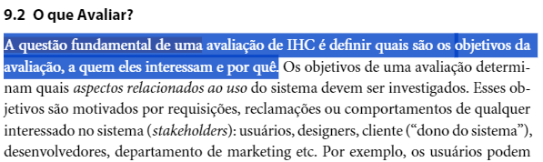
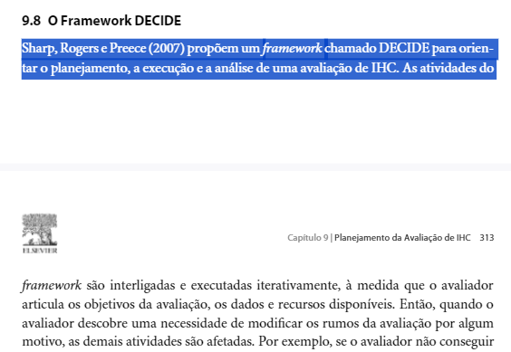
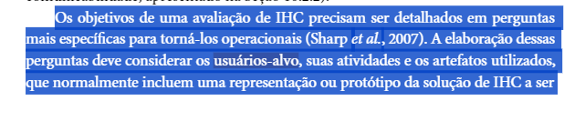

## Metodologia
A metodologia utilizada será aquele que foi estabelecida no Planejamento da Verificação. Desta forma, conforme o template padronizado que foi definido, estabeleceremos um checklist para esse artefato contendo a fonte de onde o item foi retirado com um imagem abaixo. 

### Participantes
A avaliação designada para a criação e desenvolvimento da lista de verificação desse artefato será conduzida por [Pedro Henrique](https://github.com/PedroHhenriq), enquanto o revisor responsável por aplicar a verificação ao Grupo 8 será o [Lucas Avelar](https://github.com/LucasAvelar2711).

## Checklist

- **Item 1:** **O contexto da avaliação da análise de tarefa está claramente definido, incluindo os objetivos da avaliação, aqueles que serão entrevistados, o motivo da avaliação e as tarefas que serão analisadas?** 
    - **Fonte:** Página 290, Capítulo 9. Barbosa, S. D. J.; Silva, B. S. da (2010) - Interação Humano-Computador.
    - **Imagem:** 

Imagem 1 - Objetivos da avaliação 

- **Item 2:** **O objetivo da avaliação está de acordo com os interesses e necessidades dos usuários, estando em conformidade com os 4 principais aspectos:  Apropriação de tecnologia pelos usuários, ideias e alternativas de design, conformidade com um padrão e problemas na interação e na interface (Hix e Hartson, 1993; Rubin, 1994; Mack e Nielsen, 1994; Sharp et al., 2007)?** 
    - **Fonte:** Página 290, Capítulo 9. Barbosa, S. D. J.; Silva, B. S. da (2010) - Interação Humano-Computador.
    - **Imagem:** 

Imagem 2 - Principais aspectos  

- **Item 3:** **As perguntas que serão conduzidas na entrevista estão alinhadas com o(s) objetivo(s) definido(s)?** 
    - **Fonte:** Página 292, Capítulo 9. Barbosa, S. D. J.; Silva, B. S. da (2010) - Interação Humano-Computador. 
    - **Imagem:** 

Imagem 3 -  Objetivos alinhado a perguntas 

- **Item 4:** **É utilizado o Framework DECIDE conforme proposto por Sharp, Rogers e Preece (2007)?** 
    - **Fonte:** Página 312, Capítulo 9. Barbosa, S. D. J.; Silva, B. S. da (2010) - Interação Humano-Computador.
    - **Imagem:** 

Imagem 4 - Framework Decide 

- **Item 5:** **O planejamento também aborda aspectos práticos da avaliação como: Recrutamento dos participantes, a utilização dos equipamentos, a preparação, orçamento, prazos e mão-de-obra disponíveis?** 
    - **Fonte:** Página 312, Capítulo 9. Barbosa, S. D. J.; Silva, B. S. da (2010) - Interação Humano-Computador.
    - **Imagem:** 

Imagem 5 - I(Identificar) 

- **Item 6:** **As perguntas desenvolvidas, assim como o planejamento, estão de acordo com o perfil do usuário que foi estabelecido previamente?** 
    - **Fonte:** Página 312, Capítulo 9. Barbosa, S. D. J.; Silva, B. S. da (2010) - Interação Humano-Computador. 
    - **Imagem:** 

Imagem 6 - Perguntas alinhadas ao perfil 

- **Item 7:** **É estabelecido um teste piloto no planejamento que foi realizado antes da avaliação?** 
    - **Fonte:** Página 307, Capítulo 9. Barbosa, S. D. J.; Silva, B. S. da (2010) - Interação Humano-Computador.
    - **Imagem:** 

Imagem 7 - Teste Piloto 

## Resultado do Checklist

 

| Item | Descrição      | Versão do Artefato | Avaliação      | Descrição do problema | Sugestão de Ação Corretiva | Observações |
| ---- | -------------- | ------------------ | -------------- | --------------------- | -------------------------- | ----------- |
|  1   |O contexto da avaliação da análise de tarefa está claramente definido, incluindo os objetivos da avaliação, aqueles que serão entrevistados, o motivo da avaliação e as tarefas que serão analisadas? | 1.0 | Conforme |  | |
|  2   |O objetivo da avaliação está de acordo com os interesses e necessidades dos usuários, estando em conformidade com os 4 principais aspectos:  Apropriação de tecnologia pelos usuários, ideias e alternativas de design, conformidade com um padrão e problemas na interação e na interface (Hix e Hartson, 1993; Rubin, 1994; Mack e Nielsen, 1994; Sharp et al., 2007)? | 1.0 | Conforme |  |  | |
|  3   | As perguntas que serão conduzidas na entrevista estão alinhadas com o(s) objetivo(s) definido(s)? | 1.0 | Conforme |  | |
|  4   | É utilizado o Framework DECIDE conforme proposto por Sharp, Rogers e Preece (2007)? | 1.0 | Conforme |  | |
|  5   | O planejamento também aborda aspectos práticos da avaliação como: Recrutamento dos participantes, a utilização dos equipamentos, a preparação, orçamento, prazos e mão-de-obra disponíveis? | 1.0 | Imcompleto |  | |
|  6   | As perguntas desenvolvidas, assim como o planejamento, estão de acordo com o perfil do usuário que foi estabelecido previamente? | 1.0 | Conforme |  | |
|  7   | É estabelecido um teste piloto no planejamento que foi realizado antes da avaliação? | 1.0 | Conforme |  | |
 

Tabela 1, Checklist.

Fonte: Lucas Avelar, 2024

## Referências Bibliográficas
> - Barbosa, S. D. J.; Silva, B. S. da (2010) Interação Humano-Computador.

## Histórico de Versões

| Versão |    Data    | Descrição                                 | Autor(es)                                       | Revisor(es)                                    |
| ------ | :--------: | ----------------------------------------- | ----------------------------------------------- | ---------------------------------------------- |
| `1.0`   | 10/06/2024 | Criação da página                         | [Bruna Lima](https://github.com/libruna) | [Mariana Letícia](https://github.com/Marianannn)   |
| `2.0`   | 12/06/2024 |   Criação da Lista de verificação do Planejamento da Avaliação da Analise de Tarefas                      | [Pedro Henrique](https://github.com/PedroHhenriq) |  [Mariana Letícia](https://github.com/Marianannn)  |