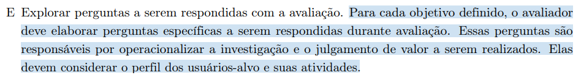
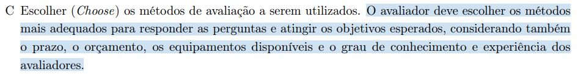
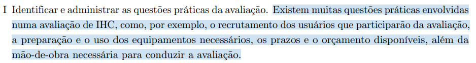
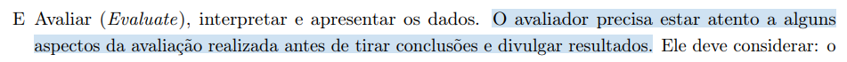

## Introdução
A verificação é uma etapa crítica no desenvolvimento de software, com o objetivo de garantir sua qualidade e desempenho adequado.

Nesse contexto, apresentamos a verificação do Planejamento da Avaliação do Storyboard do [Grupo 08](https://interacao-humano-computador.github.io/2024.1-Central-Expresso) (Central Expresso).

## Metodologia
Considerando o método definido no planejamento, a verificação ocorrerá por meio da inspeção. 

### Participantes
A [Bruna Lima](https://github.com/libruna) foi responsável pela elaboração da lista de verificação, enquanto a [Daniela Alarcão](https://github.com/danialarcao) ficou responsável pela revisão do artefato.

## Checklist
A lista de verificações abaixo detalha os aspectos que serão analisados durante a verificação do artefato, com suas respectivas fontes e imagens de referência.

- **Item 1:** **O planejamento descreve os objetivos da avaliação, por que e para quem tais objetivos são importantes?** 
    - **Fonte:** Página 288, Capítulo 11. Planejamento da Avaliação de IHC. Livro: *Barbosa, S. D. J.; Silva, B. S. da; Silveira, M. S.; Gasparini, I.; Darin, T.; Barbosa, G. D. J. (2021) Interação Humano-Computador e Experiência do usuário.*. 
    - **Imagem:** 

Imagem 1 - Destaque no livro sobre os objetivos da avaliação. 

- **Item 2:** **O planejamento explora as perguntas específicas de cada objetivo definido?** 
    - **Fonte:** Página 288, Capítulo 11. Planejamento da Avaliação de IHC. Livro: *Barbosa, S. D. J.; Silva, B. S. da; Silveira, M. S.; Gasparini, I.; Darin, T.; Barbosa, G. D. J. (2021) Interação Humano-Computador e Experiência do usuário.*. 
    - **Imagem:** 

Imagem 2 - Destaque no livro sobre explorar perguntas. 

- **Item 3:** **O planejamento determina os métodos a serem utilizados na avaliação considerando o prazo, orçamento, equipamentos e experiência dos avaliadores?**
    - **Fonte:** Página 288, Capítulo 11. Planejamento da Avaliação de IHC. Livro: *Barbosa, S. D. J.; Silva, B. S. da; Silveira, M. S.; Gasparini, I.; Darin, T.; Barbosa, G. D. J. (2021) Interação Humano-Computador e Experiência do usuário.*. 
    - **Imagem:** 

Imagem 3 - Destaque no livro sobre os métodos utilizados na avaliação. 

- **Item 4:** **O planejamento justifica para o método adotado, a escolha do perfil e o número de participantes?**
    - **Fonte:** Página 274, Capítulo 11. Planejamento da Avaliação de IHC. Livro: *Barbosa, S. D. J.; Silva, B. S. da; Silveira, M. S.; Gasparini, I.; Darin, T.; Barbosa, G. D. J. (2021) Interação Humano-Computador e Experiência do usuário.*. 
    - **Imagem:** 

Imagem 3 - Destaque no livro sobre os métodos utilizados na avaliação. 

- **Item 5:** **O planejamento aborda questões práticas da avaliação, como o recrutamento dos usuários, a preparação e o uso dos equipamentos, os prazos, o orçamento disponível e a mão-de-obra para conduzir as avaliações?**
    - **Fonte:** Página 288, Capítulo 11. Planejamento da Avaliação de IHC. Livro: *Barbosa, S. D. J.; Silva, B. S. da; Silveira, M. S.; Gasparini, I.; Darin, T.; Barbosa, G. D. J. (2021) Interação Humano-Computador e Experiência do usuário.*. 
    - **Imagem:** 

Imagem 5 - Destaque no livro sobre as questões práticas da avaliação. 

- **Item 6:** **O planejamento descreve como lidar com as questões éticas?** 
    - **Fonte:** Página 288, Capítulo 11. Planejamento da Avaliação de IHC. Livro: *Barbosa, S. D. J.; Silva, B. S. da; Silveira, M. S.; Gasparini, I.; Darin, T.; Barbosa, G. D. J. (2021) Interação Humano-Computador e Experiência do usuário.*. 
    - **Imagem:** 

Imagem 6 - Destaque no livro sobre como lidar com questões éticas. 

- **Item 7:** **O planejamento descreve como o grupo irá avaliar, interpretar e apresentar os dados?** 
    - **Fonte:** Página 288, Capítulo 11. Planejamento da Avaliação de IHC. Livro: *Barbosa, S. D. J.; Silva, B. S. da; Silveira, M. S.; Gasparini, I.; Darin, T.; Barbosa, G. D. J. (2021) Interação Humano-Computador e Experiência do usuário.*. 
    - **Imagem:** 

Imagem 7 - Destaque no livro sobre avaliação, interpretação e apresentação dos dados. 

- **Item 8:** **O documento inclui um planejamento para a realização do teste piloto?**
    - **Fonte:** Página 276, Capítulo 11. Planejamento da Avaliação de IHC. Livro: *Barbosa, S. D. J.; Silva, B. S. da; Silveira, M. S.; Gasparini, I.; Darin, T.; Barbosa, G. D. J. (2021) Interação Humano-Computador e Experiência do usuário.*. 
    - **Imagem:** 

Imagem 8 - Destaque no livro sobre o teste piloto. 

## Biografia
> - Barbosa, S. D. J.; Silva, B. S. da; Silveira, M. S.; Gasparini, I.; Darin, T.; Barbosa, G. D. J. (2021) Interação Humano-Computador e Experiência do usuário.

## Histórico de Versões

| Versão |    Data    | Descrição                                 | Autor(es)                                       | Revisor(es)                                    |
| ------ | :--------: | ----------------------------------------- | ----------------------------------------------- | ---------------------------------------------- |
| `1.0`   | 10/06/2024 | Criação da página                         | [Bruna Lima](https://github.com/libruna) |   |
| `2.0`   | 11/06/2024 | Adição do checklist | [Bruna Lima](https://github.com/libruna) |   |