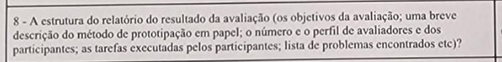
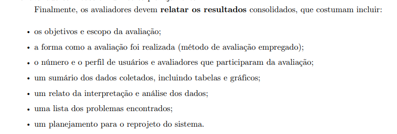
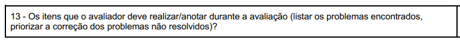

## Introdução
Verificar o planejamento do relato dos resultados é fundamental para conseguir organizar a maneira como os avaliadores coletarão e analisarão os dados para pesquisas futuras e para o reprojeto. 

Sendo assim, a seguir, será documentado a metodologia, os templates de checklists e os resultados da avaliação conforme esses templates, todos focados no planejamento da avaliação do relato dos resultados do storyboard.

## Metodologia
Será inicialmente evidenciado todos os checklists a serem verificados e depois os avaliadores irão inserir uma tabela, como consta no [Planejamento da verificação](../../../planejamento_verificacao.md), com os devidos resultados das análises feitas. 

A verificação será feita através da inspeção por percurso coginitivo. Os maiores detalhes sobre como funciona a metodologia estão no [Planejamento da verificação](../../../planejamento_verificacao.md).

### Participantes
A **avaliadora** responsável por desenvolver a lista de verificação da etapa 2 para o grupo 8 será a [Mariana Letícia](https://github.com/Marianannn), e os **revisores** serão [Bruna Lima](https://github.com/libruna), [Daniela Alarcão](https://github.com/danialarcao), [Lucas Avelar](https://github.com/LucasAvelar2711) e  [Pedro Henrique](https://github.com/PedroHhenriq)

### Template de Checklist - Planejamento do Relato dos Resultados do StoryBoard

- **Item 1:** A estrutura do relatório do resultado da avaliação(os objetivos da avaliação;  o número e o perfil de avaliadores e dos participantes; as tarefas executadas pelos participantes; lista de problemas encontrados), assim como está descrito na figura 1?
    - **Fonte:**  disponível no canal do telegram da disciplina - IHC Turma 1 (1/2024) - Prof. André (1)
    - **Imagem:**
     

    

    

    

    
Figura 1: Elementos na estrutura no relato dos resultados.

- **Item 2:** Complementando o item anterior, foi constado metodologia(modo como a avaliação foi realizada), sumário dos dados coletados, relato da interpretação dos dados, e uma planejamento para reprojeto do sistema, assim como está mencionado na figura 2?
    - **Fonte:**  Barbosa, Simone D. J. et al. Interação Humano-Computador e Experiência do Usuário. Autopublicação, 2021, p. 279.
    - **Imagem:**
     

    

    

    

    
 Figura 2: Lista de Elementos que um relato de resultados deve conter.

- **Item 3:** O artefato possui os itens que o avaliador precisa anotar ao decorrer da avaliação, segundo a figura 3 a seguir?
    - **Fonte:**  disponível no plano de ensino da disciplina de IHC semestre 2024.1 (2).
    - **Imagem:**
     

    

    

    

    
Figura 3: Detalhamento sobre os problemas encontrados.

### Resultado da Checklist - Planejamento do Relato dos Resultados do StoryBoard

A tabela 1, logo abaixo, mostra o modelo de como avaliaremos os erros evidenciados:

 

| Item | Descrição      | Avaliação      | Descrição do problema | Sugestão de Ação Corretiva | Observações |
| ---- | -------------- | -------------- | --------------------- | -------------------------- | ----------- |
|  1   | Perfil do Usuário | não conforme | Ausência de informações no Perfil do Usuário |Inserir as informações relacionadas a x, y e z | Pode ser necessário realizar coletas adicionais de dados |

Tabela 1: Exemplo de estrutura para checklist de verificação.

Fonte: Bruna Lima, 2024

## Biografia

## Referências Bibliográficas
> 1. Barros, A.(2024). Entrega da apresentação do projeto etapa 4: Planejamento da avaliação do StoryBoard e Análise de Tarefas, planejamento do relato dos resultados da avaliação do Storyboard e o planejamento do relato dos resultados da avaliação da Análise de tarefas . [Documento PDF]
> 2. Barros, André. Plano de Ensino FIHC 012024 Turma 1 v2. 2024. Disponível em: https://aprender3.unb.br/pluginfile.php/2843624/mod_resource/content/51/Plano_de_Ensino%20FIHC%20012024%20Turma%201%20v2.pdf. Acesso em: 11 jun. 2024.
> 3. Barbosa, Simone D. J. et al. Interação Humano-Computador e Experiência do Usuário. Autopublicação, 2021, p. 279.

## Histórico de Versões

| Versão |    Data    | Descrição                                 | Autor(es)                                       | Revisor(es)                                    |
| ------ | :--------: | ----------------------------------------- | ----------------------------------------------- | ---------------------------------------------- |
| `1.0`   | 10/06/2024 | Criação da página                         | [Bruna Lima](https://github.com/libruna) |  [Mariana Letícia](https://github.com/Marianannn)  |
| `2.0`   | 11/06/2024 | adicão de introdução e template de checklist do storyboard                          | [Mariana Letícia](https://github.com/Marianannn) | [Bruna Lima](https://github.com/libruna) | 