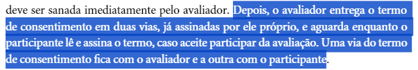
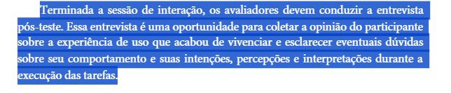
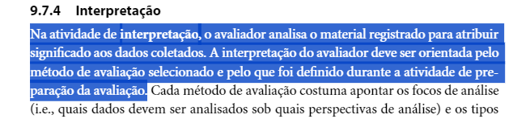

## Metodologia
Conforme previamente estabelecido, utilizaremos a metodologia adotada no Planejamento da Verificação. Desta maneirfa, conforme a utilização de um template estabelecido, o checklist abaixo será separado por itens, contendo a fonte e uma imagem de onde ela foi coletada. 

### Participantes
O responsável por criar e desenvolver a lista de verificação desse artefato será o [Pedro Henrique](https://github.com/PedroHhenriq), enquanto aquele que revisará, aplicando a verificação ao grupo 8 nessa etapa será o [Lucas Avelar](https://github.com/LucasAvelar2711).

## Checklist

- **Item 1:** **Nas avaliações, foi apresentado ao entrevistado um termo de consentimento?** 
    - **Fonte:** Página 309, Capítulo 9. Barbosa, S. D. J.; Silva, B. S. da (2010) - Interação Humano-Computador.
    - **Imagem:** 

Imagem 1 - Apresentação do Termo de Consentimento 

- **Item 2:** **Foram relatados todos os tópicos que deveriam ter sido incluidos no planejamento dos relatos?** 
    - **Fonte:** Página 312, Capítulo 9. Barbosa, S. D. J.; Silva, B. S. da (2010) - Interação Humano-Computador.
    - **Imagem:** 

Imagem 2 - Tópicos do relato 

- **Item 3:** **Foram coletadas opiniões dos entrevistados acerca da avaliação? Esses feedbacks, sugestões ou correções estão relatados?** 
    - **Fonte:** Página 310, Capítulo 9. Barbosa, S. D. J.; Silva, B. S. da (2010) - Interação Humano-Computador.
    - **Imagem:** 

 Imagem 3 - Coleta de opiniões 

- **Item 4:** **Foi realizado um trabalho de análise e intepretação dos dados coletados? Essa análise está relatada e alinhado com o método que foi definido?** 
    - **Fonte:** Página 310, Capítulo 9. Barbosa, S. D. J.; Silva, B. S. da (2010) - Interação Humano-Computador.
    - **Imagem:** 

Imagem 4 - Análise e interpretação de dados 

## Resultado do Checklist

 

| Item | Descrição      | Versão do Artefato | Avaliação      | Descrição do problema | Sugestão de Ação Corretiva | Observações |
| ---- | -------------- | ------------------ | -------------- | --------------------- | -------------------------- | ----------- |
|  1   |Nas avaliações, foi apresentado ao entrevistado um termo de consentimento? | 1.0 | Conforme |  | |
|  2   |Foram relatados todos os tópicos que deveriam ter sido incluidos no planejamento dos relatos? | 1.0 | Conforme |  |  | |
|  3   |Foram coletadas opiniões dos entrevistados acerca da avaliação? Esses feedbacks, sugestões ou correções estão relatados? | 1.0 | Conforme |  | |
|  4   | Foi realizado um trabalho de análise e intepretação dos dados coletados? Essa análise está relatada e alinhado com o método que foi definido? | 1.0 | Conforme |  | |

Tabela 1: Checklist 

Fonte: Lucas Avelar, 2024

## Referências Bibliográficas
> - Barbosa, S. D. J.; Silva, B. S. da (2010) Interação Humano-Computador.

## Histórico de Versões

| Versão |    Data    | Descrição                                 | Autor(es)                                       | Revisor(es)                                    |
| ------ | :--------: | ----------------------------------------- | ----------------------------------------------- | ---------------------------------------------- |
| `1.0`   | 10/06/2024 | Criação da página                         | [Bruna Lima](https://github.com/libruna) |   |
| `2.0`   | 12/06/2024 |  Criação da lista de verificação dos Relato dos Resultados do Storyboard     | [Pedro Henrique](https://github.com/PedroHhenriq) |   |
