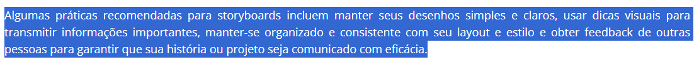

## Introdução
A verificação é uma etapa crítica no desenvolvimento de software, com o objetivo de garantir sua qualidade e desempenho adequado.

Nesse contexto, apresentamos a verificação dos Storyboards produzidos pelos integrantes do [Grupo 08](https://interacao-humano-computador.github.io/2024.1-Central-Expresso) (Central Expresso).

## Metodologia
Considerando o método definido no planejamento, a verificação ocorrerá por meio da inspeção. 

### Participantes
Para este artefato, cada membro do Grupo 07 irá avaliar um storyboard de uma funcionalidade do Grupo 08.

## Checklist
A lista de verificações abaixo detalha os aspectos que serão analisados durante a verificação do artefato, com suas respectivas fontes e imagens de referência.

- **Item 1:** **Aprensenta as quatro características principais de um storyboard: o cenário, as atividades, os visuais e a história?** 
    - **Fonte:** Tópico 4. O que é um storyboard? Miro: *https://miro.com/pt/storyboard/o-que-e-storyboard/*
    - **Imagem:** 

Imagem 1 - Destaque no site sobre as características principais de um storyboard. 

- **Item 2:** **Outros elementos-chave, como personagens, enredo, diálogo e dicas visuais, foram incluídos no storyboard?** 
    - **Fonte:** Storyboarding Eficaz, StoryboardThat. *https://www.storyboardthat.com/pt/articles/e/como-fazer-seu-storyboards-pop*
    - **Imagem:** 

Imagem 2 - Destaque no site sobre o que um storyboard deve incluir. 

- **Item 3:** **Os desenhos do storyboard são simples e claros?** 
    - **Fonte:** Storyboarding Eficaz, StoryboardThat. *https://www.storyboardthat.com/pt/articles/e/como-fazer-seu-storyboards-pop*
    - **Imagem:** 

Imagem 3 - Destaque no site sobre práticas recomendadas para storyboards. 

- **Item 4:** **É possível confirmar que o storyboard criado não possui cenas/imagens do produto final?** 
    - **Fonte:** Página 9, Tópico "Descriptive content of a storyboard".*THE OCR GUIDE TO STORYBOARDS - Skill Guide*
    - **Imagem:**  
    

Imagem 4 - Destaque no guia sobre conteúdo de um storyboard. 

- **Item 5:** **O storyboard consegue transmitir a ideia de uso da funcionalidade em um contexto real?** 
    - **Fonte:** Storyboarding Eficaz, StoryboardThat. *https://www.storyboardthat.com/pt/articles/e/como-fazer-seu-storyboards-pop*
    - **Imagem:** 

Imagem 5 - Destaque no site sobre importância dos storyboards. 

## Biografia
> - O que é um storyboard? Miro. Disponível em: https://miro.com/pt/storyboard/o-que-e-storyboard/
> - Como fazer seu storoboard. StoryboardThat. Disponível em: https://www.storyboardthat.com/pt/articles/e/como-fazer-seu-storyboards-pop
> - THE OCR GUIDE TO STORYBOARDS - Skill Guide. Disponível em: https://www.ocr.org.uk/Images/579489-guide-to-storyboards.pdf

## Histórico de Versões

| Versão |    Data    | Descrição                                 | Autor(es)                                       | Revisor(es)                                    |
| ------ | :--------: | ----------------------------------------- | ----------------------------------------------- | ---------------------------------------------- |
| `1.0`   | 10/06/2024 | Criação da página                         | [Bruna Lima](https://github.com/libruna) |   |
| `2.0`   | 12/06/2024 | Adição do checklist | [Bruna Lima](https://github.com/libruna) |   |