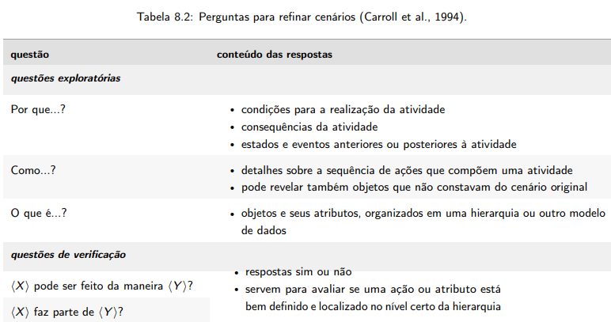

## Introdução
A verificação dos cenários se mostra como uma peça importante ao avaliar se eles condizem com a realidade daquela funcionalidade e se podemos implementá-las em diversos contextos. Sendo assim, para verificá-las, seguiremos com uma metodologia a fim de conferir se os cenários estão adequados o suficiente.

## Metodologia
A metodologia a ser abordada foi a de inspeção, devidamente explicada no [planejamento de verificação](../planejamento_verificacao.md), é uma avaliação individual que consiste na exploração da interface para identificar diversos tipos de erros. (1)

Nela, primeiramente abordaremos um template de checklist que irá ser preenchido em uma tabela modelo,  presente em [planejamento de verificação](../planejamento_verificacao.md), pelo verificador durante a avaliação do projeto [CBMERJ](https://interacao-humano-computador.github.io/2024.1-CBMERJ/).

### Participantes
A **avaliadora** responsável por desenvolver a lista de verificação da etapa 2 sobre os cenários para o grupo 7 será a [Mariana Letícia](https://github.com/Marianannn), e os **revisores** serão [Bruna Lima](https://github.com/libruna), [Daniela Alarcão](https://github.com/danialarcao), [Lucas Avelar](https://github.com/LucasAvelar2711) e  [Pedro Henrique](https://github.com/PedroHhenriq), conforme está evidente em [planejamento de verificação](../planejamento_verificacao.md).

### Checklist: Cenários

- **Item 1:** O cenário possui os seguintes 5 elementos abordado por Cooper (1999) na figura 1 a seguir: ciclo de vida de processo, segmentos de públicos, funções de produto, variantes de uma classe de situações de tarefa e métodos para realizar uma tarefa?
    - **Fonte:**  Barbosa, Simone D. J. et al. Interação Humano-Computador e Experiência do Usuário. Autopublicação, 2021, p. 176
    - **Imagem:**  

    

    

    

    
Figura 1:    5 elementos para cenários abordados por Cooper (1999)

- **Item 2:** O cenário consiste em uma narrativa real ou pitoresca, com vários detalhes e contexto em formalizado, segundo é evidente na Figura 2?
    - **Fonte:**  Barbosa, Simone D. J. et al. Interação Humano-Computador e Experiência do Usuário. Autopublicação, 2021, p. 172
    - **Imagem:**  

    

    

    

    
Figura 2: Imagem do livro citado acima descrevendo como deve ser um cenário

- **Item 3:** O cenário contém esses seguintes elementos: ambiente ou contexto; atores; objetivos; planejamento; ações; eventos; e avaliação, segundo Rosson e Carroll (2002) e Cooper (1999) e a Figura 3 a seguir?
    - **Fonte:** Barbosa, Simone D. J. et al. Interação Humano-Computador e Experiência do Usuário. Autopublicação, 2021, p. 172
    - **Imagem:**  

    

    

    

    
Figura 3: Imagem do livro citado acima descrevendo como deve ser um cenário

- **Item 4:** Os cenários respondem, segundo a figura 4 seguir, as perguntas: Por que? Como? O que é?
    - **Fonte:** Barbosa, Simone D. J. et al. Interação Humano-Computador e Experiência do Usuário. Autopublicação, 2021, p. 174
    - **Imagem:**  

    

    

    

    
Figura 4: imagem com texto descrevendo quais perguntas o cenário deve responder

<!-- template de checklist -->
<!-- - **Item 1:** (COLOCAR DESCRIÇÃO AQUI)
    - **Fonte:** 
    - **Imagem:**
     

    

    

    

    
Figura 1: (COLOCAR A DESCRIÇÃO DA PERGUNTA QUI)

- **Item 2:** (COLOCAR DESCRIÇÃO)
    - **Fonte:** (COLOCAR FONTE AQUI)
    - **Imagem:** 
     

    

    

    

    
Figura 2: (COLOCAR A LEGENDA AQUI)

- **Item 3:** (COLOCAR DESCRIÇÃO)
    - **Fonte:** (COLOCAR FONTE AQUI)
    - **Imagem:**
     

    

    

    

    
Figura 3: (COLOCAR A LEGENDA AQUI)

- **Item 4:** 
    - **Fonte:** 
    - **Imagem:**
     

    

    

    

    
Figura 4: (COLOCAR A LEGENDA AQUI)

- **Item 5:** (COLOCAR DESCRIÇÃO)
    - **Fonte:** (INSERIR FONTE)
    - **Imagem:**
     

    

    

    

    
Figura 5: (COLOCAR LEGENDA AQUI)
 -->

## Resultado do Checklist

### Cenário : Primeiros Socorros - Revisor: Daniela Alarcão
| Item | Descrição      | Versão do Artefato | Avaliação      | Descrição do problema | Sugestão de Ação Corretiva | Observações |
| ---- | -------------- | ------------------ | -------------- | --------------------- | -------------------------- | ----------- |
|  1   | O cenário possui os seguintes 5 elementos abordado por Cooper (1999) na figura 1 a seguir: ciclo de vida de processo, segmentos de públicos, funções de produto, variantes de uma classe de situações de tarefa e métodos para realizar uma tarefa? | 3.0 | Conforme | |
|  2   | O cenário consiste em uma narrativa real ou pitoresca, com vários detalhes e contexto em formalizado, segundo é evidente na Figura 2? | 3.0 | Conforme |  |   |  |
|  3   |  O cenário contém esses seguintes elementos: ambiente ou contexto; atores; objetivos; planejamento; ações; eventos; e avaliação, segundo Rosson e Carroll (2002) e Cooper (1999) e a Figura 3 a seguir? | 3.0 | Conforme | |  | 
|  4   |  Os cenários respondem, segundo a figura 4 seguir, as perguntas: Por que? Como? O que é? | 3.0 | Conforme  | | | |

Tabela 1 : Verificação do cenário Primeiros Socorros

Fonte: Daniela Alarcão, 2024

### Cenário : Solicitar Ficha de atendimento - Revisora: Mariana Letícia
| Item | Descrição      | Versão do Artefato | Avaliação      | Descrição do problema | Sugestão de Ação Corretiva | Observações |
| ---- | -------------- | ------------------ | -------------- | --------------------- | -------------------------- | ----------- |
|  1   |  O cenário possui os seguintes 5 elementos abordado por Cooper (1999) na figura 1 a seguir: ciclo de vida de processo, segmentos de públicos, funções de produto, variantes de uma classe de situações de tarefa e métodos para realizar uma tarefa? | 3.0 | conforme | |
|  2   | O cenário consiste em uma narrativa real ou pitoresca, com vários detalhes e contexto em formalizado, segundo é evidente na Figura 2? | 3.0 | conforme|  |   |  |
|  3   | O cenário contém esses seguintes elementos: ambiente ou contexto; atores; objetivos; planejamento; ações; eventos; e avaliação, segundo Rosson e Carroll (2002) e Cooper (1999) e a Figura 3 a seguir? | 3.0| conforme | |  | 
|  4   | Os cenários respondem, segundo a figura 4 seguir, as perguntas: Por que? Como? O que é? | 3.0 | conforme  | | | |

Tabela 2: Verificação do Cenário Solicitar ficha de atendimento 

Fonte: Mariana Letícia, 2024

<iframe width="560" height="315" src="https://www.youtube.com/embed/r7qgyzcD68Q?si=bg8PFN3m0kl1uyDu" title="YouTube video player" frameborder="0" allow="accelerometer; autoplay; clipboard-write; encrypted-media; gyroscope; picture-in-picture; web-share" referrerpolicy="strict-origin-when-cross-origin" allowfullscreen></iframe>

Vídeo 2: Verificação do Cenário Solicitar ficha de atendimento .

Fonte: Mariana Letícia, 2024

### Cenário : Checar e Gerar Certificado - Revisora: Bruna Lima
| Item | Descrição      | Versão do Artefato | Avaliação      | Descrição do problema | Sugestão de Ação Corretiva | Observações |
| ---- | -------------- | ------------------ | -------------- | --------------------- | -------------------------- | ----------- |
|  1   |  O cenário possui os seguintes 5 elementos abordado por Cooper (1999) na figura 1 a seguir: ciclo de vida de processo, segmentos de públicos, funções de produto, variantes de uma classe de situações de tarefa e métodos para realizar uma tarefa? | 3.0 | Conforme | |
|  2   | O cenário consiste em uma narrativa real ou pitoresca, com vários detalhes e contexto em formalizado, segundo é evidente na Figura 2? | 3.0 | Conforme |  |   |  |
|  3   | O cenário contém esses seguintes elementos: ambiente ou contexto; atores; objetivos; planejamento; ações; eventos; e avaliação, segundo Rosson e Carroll (2002) e Cooper (1999) e a Figura 3 a seguir? | 3.0 | Conforme | |  | 
|  4   | Os cenários respondem, segundo a figura 4 seguir, as perguntas: Por que? Como? O que é? | 3.0 | Conforme  | | | |

Tabela 3:Verificação do Cenário de Checar e Gerar Certificado.

Fonte: Bruna Lima, 2024

<iframe width="560" height="315" src="https://www.youtube.com/embed/BcHhlgcWgNU?si=0UFxcYoC4Vna2N1s" title="YouTube video player" frameborder="0" allow="accelerometer; autoplay; clipboard-write; encrypted-media; gyroscope; picture-in-picture; web-share" referrerpolicy="strict-origin-when-cross-origin" allowfullscreen></iframe>

Vídeo 3: Verificação do Cenário de Checar e Gerar Certificado.

Fonte: Bruna Lima, 2024

### Cenário: Agendamento de atendimento presencial - Revisor: Pedro
| Item | Descrição      | Versão do Artefato | Avaliação      | Descrição do problema | Sugestão de Ação Corretiva | Observações |
| ---- | -------------- | ------------------ | -------------- | --------------------- | -------------------------- | ----------- |
|  1   |  O cenário possui os seguintes 5 elementos abordado por Cooper (1999) na figura 1 a seguir: ciclo de vida de processo, segmentos de públicos, funções de produto, variantes de uma classe de situações de tarefa e métodos para realizar uma tarefa? | 3.0 | Conforme | |
|  2   | O cenário consiste em uma narrativa real ou pitoresca, com vários detalhes e contexto em formalizado, segundo é evidente na Figura 2? | 3.0 | Conforme |  |   |  |
|  3   | O cenário contém esses seguintes elementos: ambiente ou contexto; atores; objetivos; planejamento; ações; eventos; e avaliação, segundo Rosson e Carroll (2002) e Cooper (1999) e a Figura 3 a seguir? | 3.0 | Conforme | | Definir de forma mais explícita as atividades mentais  | Está adequado, mas não dá para compreender apropriadamente as atividades mentais que ele precisou tomar antes das suas ações e  |
|  4   | Os cenários respondem, segundo a figura 4 seguir, as perguntas: Por que? Como? O que é? | 3.0 | Conforme  | | | |

Tabela 4: Agendamento de atendimento presencial.

Fonte: Pedro Henrique, 2024

(Link do Vídeo)[https://www.youtube.com/watch?v=09P5q7TGcBk]

<iframe width="882" height="496" src="https://www.youtube.com/embed/09P5q7TGcBk" title="Verificacao Cenario" frameborder="0" allow="accelerometer; autoplay; clipboard-write; encrypted-media; gyroscope; picture-in-picture; web-share" referrerpolicy="strict-origin-when-cross-origin" allowfullscreen></iframe>

Vídeo 4: Agendamento de atendimento presencial.

Fonte: Pedro Henrique, 2024

### Cenário: Obter Declaração do Registro de Ocorrência - Revisor: Genilson Silva

| Item | Descrição      | Versão do Artefato | Avaliação      | Descrição do problema | Sugestão de Ação Corretiva | Observações |
| ---- | -------------- | ------------------ | -------------- | --------------------- | -------------------------- | ----------- |
|  1   |  O cenário possui os seguintes 5 elementos abordado por Cooper (1999) na figura 1 a seguir: ciclo de vida de processo, segmentos de públicos, funções de produto, variantes de uma classe de situações de tarefa e métodos para realizar uma tarefa? | 3.0 | Conforme | |
|  2   | O cenário consiste em uma narrativa real ou pitoresca, com vários detalhes e contexto em formalizado, segundo é evidente na Figura 2? | 3.0 | Conforme |  |   |  |
|  3   | O cenário contém esses seguintes elementos: ambiente ou contexto; atores; objetivos; planejamento; ações; eventos; e avaliação, segundo Rosson e Carroll (2002) e Cooper (1999) e a Figura 3 a seguir? | 3.0 | Conforme | |  | 
|  4   | Os cenários respondem, segundo a figura 4 seguir, as perguntas: Por que? Como? O que é? | 3.0 | Conforme  | | | |

Tabela 5: Verificação do Cenário de Obter Declaração do Registro de Ocorrência.

Fonte: Genilson Silva, 2024

<iframe width="560" height="315" src="https://www.youtube.com/embed/872DsGJ6nx4?si=M4FYYQzygAq8qIme" title="YouTube video player" frameborder="0" allow="accelerometer; autoplay; clipboard-write; encrypted-media; gyroscope; picture-in-picture; web-share" referrerpolicy="strict-origin-when-cross-origin" allowfullscreen></iframe>

Vídeo 5: Verificação do Cenário de Obter Declaração do Registro de Ocorrência.

Fonte: Genilson Silva, 2024

<!--<iframe width="560" height="315" 
src="(COLOQUE O LINK EMBED AQUI)" 
title="YouTube video player" frameborder="0" allow="accelerometer; autoplay; clipboard-write; encrypted-media; gyroscope; picture-in-picture; web-share" referrerpolicy="strict-origin-when-cross-origin" allowfullscreen></iframe>

Vídeo (COLOQUE O NUMERO DO VÍDEO AQUI): (COLOQUE O TÍTULO DO VÍDEO AQUI).

Fonte: (COLOQUE SEU NOME AQUI), 2024
 -->

## Conclusão

## Biografia
>- Barbosa, E. F., & Souza, S. R. S. (2017). Inspeção de Software. Instituto de Ciências Matemáticas e de Computação — ICMC/USP. Disponivel em: https://edisciplinas.usp.br/pluginfile.php/5306452/mod_resource/content/0/Aula02-Inspecao.pdf

## Referências Bibliográficas
> 1. Barbosa, Simone D. J. et al. Interação Humano-Computador e Experiência do Usuário. Autopublicação, 2021, p. 286.

## Histórico de Versões

| Versão |    Data    | Descrição                                 | Autor(es)                                       | Revisor(es)                                    |
| ------ | :--------: | ----------------------------------------- | ----------------------------------------------- | ---------------------------------------------- |
| `1.0`   | 13/06/2024 | Criação da página                         | [Mariana Letícia](https://github.com/Marianannn) |   |
| `2.0`   | 22/06/2024 | adição do template de cenários                         | [Mariana Letícia](https://github.com/Marianannn) |   |
| `3.0`   | 26/06/2024 | verificação do cenário primeiros socorros | [Daniela Alarcão](https://github.com/danialarcao) |   |
| `4.0`   | 26/06/2024 | Adição da verificação do cenário de checar e gerar certificado           | [Bruna Lima](https://github.com/libruna) |   |
| `5.0`   | 26/06/2024 | Adição da verificação do cenário  Agendamento de atendimento presencial         | [Pedro Henrique](https://github.com/PedroHhenriq) |   |
| `6.0`   | 26/06/2024 | Adição da verificação do cenário  Obter Declaração do Registro de Ocorrência         | [Genilson Silva](https://github.com/GenilsonJrs) |   |
