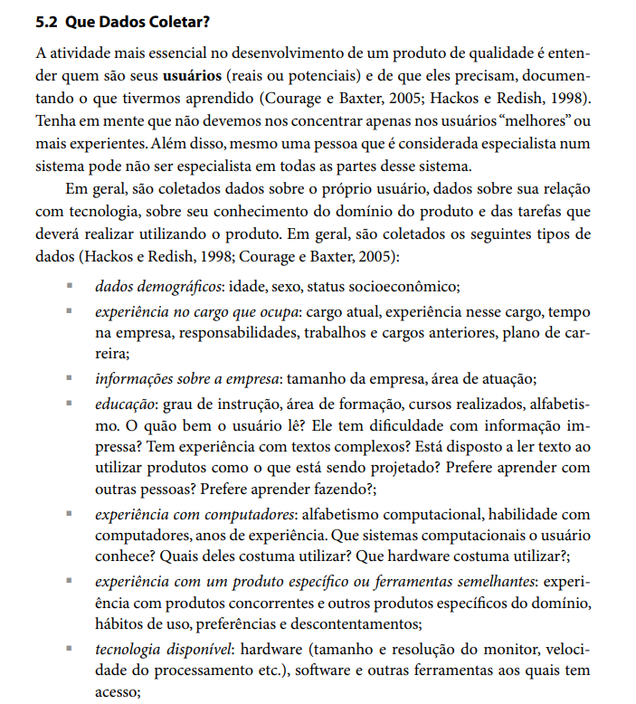
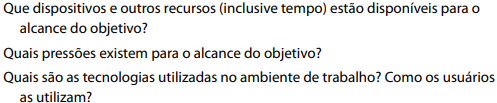

## Introdução
Revisar os componentes de um projeto é uma atividade dinâmica que pode ser exigente, pois envolve examinar o projeto, identificar falhas e propor melhorias.
Dessa forma, é possível realizar uma verificação da análise de tarefas para entender essa seção do projeto e garantir a sua aprimoração.

## Metodologia
A metodologia utilizada foi a de inspeção, conforme detalhado no [planejamento de verificação](../planejamento_verificacao.md). Este método de avaliação individual envolve a exploração da interface para identificar vários tipos de erros.

Iremos abordar um template de checklist que deverá ser preenchido bem como o modelo disposto em [planejamento de verificação](../planejamento_verificacao.md), devendo ser feita uma inspeção para cada artefato presente no nosso projeto [CBMRJ - Grupo 7](https://interacao-humano-computador.github.io/2024.1-CBMERJ/).

### Participantes
A criação da lista de verificação será conduzida pelo integrante [Genilson Silva](https://github.com/GenilsonJrs), enquanto o revisor responsável por verificar se as perguntas e itens estão adequados será [Pedro Henrique](https://github.com/PedroHhenriq) e a verificação em si da lista terá como responsável a [Bruna Lima](https://github.com/libruna).

## Checklist

- **Item 1:** O documento possui informações básicas demográficas como: Idade, Gênero, Escolaridade?
    - **Fonte:**  Barbosa, Simone D. J. et al. Interação Humano-Computador e Experiência do Usuário. Autopublicação, 2021, p. 134
    - **Imagem:**  

    

    

    

    
Figura 1: Questionamento sobre informações básicas a serem apresentadas

- **Item 2:** É especificado um contexto de uso? (Ambiente onde a pesquisa será realizada, equipamentos utilizados e forma de uso).
    - **Fonte:**  Barbosa, Simone D. J. et al. Interação Humano-Computador e Experiência do Usuário. Autopublicação, 2021, p. 187
    - **Imagem:**  

    

    

    

    
Figura 2: Questionamento sobre materiais e metodologia da pesquisa

- **Item 3:** Existe questionamento acerca de nível de experiência e preferências em relação a tecnologia?
    - **Fonte:** Barbosa, Simone D. J. et al. Interação Humano-Computador e Experiência do Usuário. Autopublicação, 2021, p. 305
    - **Imagem:**  

    

    

    

    
Figura 3: Questionamento experiência e preferencias quanto ao usuário

- **Item 4:** O documento possui preferências de interação, estilos e abertura para sugestões?
    - **Fonte:** Barbosa, Simone D. J. et al. Interação Humano-Computador e Experiência do Usuário. Autopublicação, 2021, p. 299
    - **Imagem:**  

    

    

    

    
Figura 4: Questionamento sobre abertura para preferências e demais comentários do usuário

## Resultado do Checklist
 
## Conclusão

## Biografia
>- Barbosa, E. F., & Souza, S. R. S. (2017). Inspeção de Software. Instituto de Ciências Matemáticas e de Computação — ICMC/USP. Disponivel em: https://edisciplinas.usp.br/pluginfile.php/5306452/mod_resource/content/0/Aula02-Inspecao.pdf

## Referências Bibliográficas
> 1. Barbosa, Simone D. J. et al. Interação Humano-Computador e Experiência do Usuário. Autopublicação, 2021, p. 134.
> 2. Barbosa, Simone D. J. et al. Interação Humano-Computador e Experiência do Usuário. Autopublicação, 2021, p. 187.
> 3. Barbosa, Simone D. J. et al. Interação Humano-Computador e Experiência do Usuário. Autopublicação, 2021, p. 299.
> 4. Barbosa, Simone D. J. et al. Interação Humano-Computador e Experiência do Usuário. Autopublicação, 2021, p. 305.

## Histórico de Versões

| Versão |    Data    | Descrição                                 | Autor(es)                                       | Revisor(es)                                    |
| ------ | :--------: | ----------------------------------------- | ----------------------------------------------- | ---------------------------------------------- |
| `1.0`   | 13/06/2024 | Criação da página                         | [Mariana Letícia](https://github.com/Marianannn) |[Genilson Silva](https://github.com/GenilsonJrs)   |
| `2.0`   | 26/06/2024 | Adição do Checklist                   | [Genilson Silva](https://github.com/GenilsonJrs) |  [Pedro Henrique](https://github.com/PedroHhenriq) |
