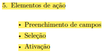
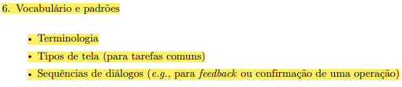

## Introdução

 A verificação é uma das fases cruciais no desenvolvimento de um projeto. Durante essa etapa, os artefatos gerados são minuciosamente examinados para assegurar que atendam aos requisitos estabelecidos. Portanto, este documento apresenta o cronograma elaborado para a verificação dos artefatos desenvolvidos pelo nosso grupo acerca do guia de estilo. 

## Metodologia

 O método escolhido para a verificação é o de inspeção. Este método permite uma análise minuciosa dos artefatos, envolvendo uma equipe de revisores que trazem diferentes perspectivas, aumentando a probabilidade de detectar problemas. Esse método também facilita a documentação dos achados, permitindo um acompanhamento detalhado das correções necessárias. 
 

### Participantes

 A integrante <strong>Daniela Alarcão</strong> é a responsável pela elaboração da lista de verificação do guia de estilo da etapa 3. A verificação deste artefato é de responsabilidade do integrante <strong>Genilson Silva.</strong> A revisão do checklist é de responsabilidade do integrante <strong>Lucas Avelar</strong>.

### Template de Checklist: Guia de Estilo
- **Item 1:** A estrutura da introdução do guia de estilo contempla os tópicos "Objetivos", "Organização e conteúdo", "Público-alvo", "Como utilizar o guia" e "Como manter o guia"? Estes tópicos são bem explicados?
    - **Fonte:** Barbosa, Simone D. J. et al. Interação Humano-Computador e Experiência do Usuário. Autopublicação, 2021, p. 272.
    - **Imagem:**
     
    

    
      
    
Figura 1: 10.5 Guias de Estilo - Introdução. 
 

- **Item 2:** Em relação aos elementos de interface, o guia de estilo descreve e ilustra os tópicos "Disposição espacial e grid", "Janelas", "Tipografia", "Símbolos não tipográficos", "Cores" e "Animações"?
    - **Fonte:** Barbosa, Simone D. J. et al. Interação Humano-Computador e Experiência do Usuário. Autopublicação, 2021, p. 272.
    - **Imagem:**
     
    

    
      
    
Figura 2: 10.5 Guias de Estilo - Elementos de Interface. 
     

- **Item 3:** Em relação aos elementos de interação, o guia de estilo descreve e ilustra os tópicos "Estilos de interação", "Seleção de um estilo" e "Aceleradores (teclas de atalho)"?
    - **Fonte:** Barbosa, Simone D. J. et al. Interação Humano-Computador e Experiência do Usuário. Autopublicação, 2021, p. 272.
    - **Imagem:**
     
    

    
      
    
Figura 3: 10.5 Guias de Estilo - Elementos de Interação. 
     

- **Item 4:** Em relação aos elementos de ação, o guia de estilo descreve e ilustra os tópicos "Preenchimento de campos", "Seleção" e "Ativação"?
    - **Fonte:** Barbosa, Simone D. J. et al. Interação Humano-Computador e Experiência do Usuário. Autopublicação, 2021, p. 272.
    - **Imagem:**
     
    

    
      
    
Figura 4: 10.5 Guias de Estilo - Elementos de Ação. 
  

- **Item 5:** Em relação ao vocabulário e aos padrões do site, o guia de estilo descreve e ilustra os tópicos "Terminologia", "Tipos de tela (para tarefas comuns)" e "Sequências de diálogos"?
    - **Fonte:** Barbosa, Simone D. J. et al. Interação Humano-Computador e Experiência do Usuário. Autopublicação, 2021, p. 272.
    - **Imagem:**
     
    

    
      
    
Figura 5: 10.5 Guias de Estilo - Vocabulários e padrões. 
  

## Resultado do Checklist

### Guia de Estilo - Revisor: Genilson Silva

| Item | Descrição | Versão do Artefato | Avaliação | Descrição do problema | Sugestão de Ação Corretiva | Observações |
| ---- | --------- | ------------------ | --------- | --------------------- | -------------------------- | ----------- |
|  1   | A estrutura da introdução do guia de estilo contempla os tópicos "Objetivos", "Organização e conteúdo", "Público-alvo", "Como utilizar o guia" e "Como manter o guia"? Estes tópicos são bem explicados? | 1.0 | Incompleto | Não está presente no documento alguns tópicos e infomações. | Adicionar os tópicos Organização, Conteúdo e Publico alvo.| |
|  2   | Em relação aos elementos de interface, o guia de estilo descreve e ilustra os tópicos "Disposição espacial e grid", "Janelas", "Tipografia", "Símbolos não tipográficos", "Cores" e "Animações"? | 1.0 | Não Conforme | Não possui nenhum dos tópicos e o Figma não funciona.| Adicionar tópicos e corrigir Figma. | Colocar um link para poder acessar o figma mais facilmente. |
|  3   | Em relação aos elementos de interação, o guia de estilo descreve e ilustra os tópicos "Estilos de interação", "Seleção de um estilo" e "Aceleradores (teclas de atalho)"? | 1.0 | Não Conforme | Não possui nenhum dos tópicos.| Adição dos tópicos e correção do Figma.| |
|  4   | Em relação aos elementos de ação, o guia de estilo descreve e ilustra os tópicos "Preenchimento de campos", "Seleção" e "Ativação"? | 1.0 | Não Conforme |Não possui os tópicos e o Figma não aparece, não permitindo conferir. | Adicionar tópicos e ajustar figma com link externo. | |
|  5   | Em relação ao vocabulário e aos padrões do site, o guia de estilo descreve e ilustra os tópicos "Terminologia", "Tipos de tela (para tarefas comuns)" e "Sequências de diálogos"? | 1.0 | Conforme | | | |

Tabela 1: Verificação do Guia de Estilo. 

Fonte: Genilson Silva, 2024

**A gravação da verificação encontra-se abaixo:**

<iframe width="560" height="315" src="https://www.youtube.com/embed/bCXZG685FZY?si=37PiFG_xaQwPbqKL" title="YouTube video player" frameborder="0" allow="accelerometer; autoplay; clipboard-write; encrypted-media; gyroscope; picture-in-picture; web-share" referrerpolicy="strict-origin-when-cross-origin" allowfullscreen></iframe>

Video 1: Verificação do Guia de Estilo.

Fonte: Genilson Silva, 2024.

## Biografia
>- Barbosa, E. F., & Souza, S. R. S. (2017). Inspeção de Software. Instituto de Ciências Matemáticas e de Computação — ICMC/USP. Disponivel em: https://edisciplinas.usp.br/pluginfile.php/5306452/mod_resource/content/0/Aula02-Inspecao.pdf

## Referências Bibliográficas

## Histórico de Versões

| Versão |    Data    | Descrição                                 | Autor(es)                                       | Revisor(es)                                    |
| ------ | :--------: | ----------------------------------------- | ----------------------------------------------- | ---------------------------------------------- |
| `1.0`   | 18/06/2024 | Criação da página                         | [Mariana Letícia](https://github.com/Marianannn) |  [Pedro Henrique](https://github.com/PedroHhenriq) |
| `2.0`   | 26/06/2024 | Adição de checklist                         | [Daniela Alarcão](https://github.com/danialarcao) | [Pedro Henrique](https://github.com/PedroHhenriq)  |
| `3.0`   | 26/06/2024 | Verificação checklist                         | [Genilson Silva](https://github.com/GenilsonJrs) |  [Pedro Henrique](https://github.com/PedroHhenriq) |