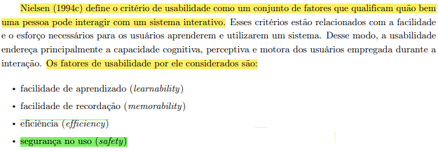

## Introdução

 A verificação é uma das fases cruciais no desenvolvimento de um projeto. Durante essa etapa, os artefatos gerados são minuciosamente examinados para assegurar que atendam aos requisitos estabelecidos. Portanto, este documento apresenta o cronograma elaborado para a verificação dos artefatos desenvolvidos pelo nosso grupo acerca das metas de usabilidade. 

## Metodologia

 O método escolhido para a verificação é o de inspeção. Este método permite uma análise minuciosa dos artefatos, envolvendo uma equipe de revisores que trazem diferentes perspectivas, aumentando a probabilidade de detectar problemas. Esse método também facilita a documentação dos achados, permitindo um acompanhamento detalhado das correções necessárias. 
 

### Participantes

 A integrante <strong>Daniela Alarcão</strong> é a responsável pela elaboração da lista de verificação das metas de usabilidade da etapa 3. A revisão deste artefato ficará na responsabilidade do integrante <strong>Genilson Silva.</strong>

### Template de Checklist: Metas de Usabilidade
- **Item 1:** A facilidade de aprendizado é uma das metas de usabilidade? O objetivo desta meta está bem explicado? 
    - **Fonte:** Barbosa, Simone D. J. et al. Interação Humano-Computador e Experiência do Usuário. Autopublicação, 2021, p. 49.
    - **Imagem:**
     
    

    
      
    
Figura 1: 3.2.1 Usabilidade - Learnability. 
 

- **Item 2:** A facilidade de recordação/memorização é uma das metas de usabilidade? O objetivo desta meta está bem explicado? 
    - **Fonte:** Barbosa, Simone D. J. et al. Interação Humano-Computador e Experiência do Usuário. Autopublicação, 2021, p. 49.
    - **Imagem:**
     
    

    
      
    
Figura 2: 3.2.1 Usabilidade - Memorability. 
 

- **Item 3:** A eficiência é uma das metas de usabilidade? O objetivo desta meta está bem explicado?
    - **Fonte:** Barbosa, Simone D. J. et al. Interação Humano-Computador e Experiência do Usuário. Autopublicação, 2021, p. 49.
    - **Imagem:**
     
    

    
      
    
Figura 3: 3.2.1 Usabilidade - Efficiency. 
 

- **Item 4:** A segurança é uma das metas de usabilidade? O objetivo desta meta está bem explicado?
    - **Fonte:** Barbosa, Simone D. J. et al. Interação Humano-Computador e Experiência do Usuário. Autopublicação, 2021, p. 49 .
    - **Imagem:**
     
    

    
      
    
Figura 4: 3.2.1 Usabilidade - Safety. 
 

- **Item 5:** A satisfação do usuário é uma das metas de usabilidade? O objetivo desta meta está bem explicado?
    - **Fonte:** Barbosa, Simone D. J. et al. Interação Humano-Computador e Experiência do Usuário. Autopublicação, 2021, p. 50.
    - **Imagem:**
     
    

    
    
      
    
Figura 5: 3.2.1 Usabilidade - Satisfaction . 
 

## Resultado do Checklist
 <!-- template de VERIFICAÇÃO -->

<!-- 
| Item | Descrição      | Versão do Artefato | Avaliação      | Descrição do problema | Sugestão de Ação Corretiva | Observações |
| ---- | -------------- | ------------------ | -------------- | --------------------- | -------------------------- | ----------- |
|  1   | (COLOCAR DECRIÇÃO DO ITEM 1 AQUI) | (COLOCAR SE ESTÁ CONFORME OU NÃO CONFORME) |  | |
|  2   | (COLOCAR DECRIÇÃO DO ITEM 2 AQUI) | (COLOCAR VERSÃO AQUI) | (COLOCAR SE ESTÁ CONFORME OU NÃO CONFORME)|  |   |  |
|  3   | (COLOCAR DECRIÇÃO DO ITEM 3 AQUI) | (COLOCAR VERSÃO AQUI)| (COLOCAR SE ESTÁ CONFORME OU NÃO CONFORME) | |  | 
|  4   | (COLOCAR DECRIÇÃO DO ITEM 4 AQUI) | (COLOCAR VERSÃO AQUI) | (COLOCAR SE ESTÁ CONFORME OU NÃO CONFORME)  | | | |
|  5   | (COLOCAR DECRIÇÃO DO ITEM 5 AQUI) | (COLOCAR VERSÃO AQUI)| (COLOCAR SE ESTÁ CONFORME OU NÃO CONFORME)  | | |  |

Tabela (COLQUE O NUMERO DA TABELA AQUI): (COLOQUE O TÍTULO DA TABELA AQUI)

Fonte: (COLOQUE SEU NOME AQUI), 2024

<iframe width="560" height="315" 
src="(COLOQUE O LINK EMBED AQUI)" 
title="YouTube video player" frameborder="0" allow="accelerometer; autoplay; clipboard-write; encrypted-media; gyroscope; picture-in-picture; web-share" referrerpolicy="strict-origin-when-cross-origin" allowfullscreen></iframe>

Vídeo (COLOQUE O NUMERO DO VÍDEO AQUI): (COLOQUE O TÍTULO DO VÍDEO AQUI).

Fonte: (COLOQUE SEU NOME AQUI), 2024
 -->

## Conclusão

## Biografia
>- Barbosa, E. F., & Souza, S. R. S. (2017). Inspeção de Software. Instituto de Ciências Matemáticas e de Computação — ICMC/USP. Disponivel em: https://edisciplinas.usp.br/pluginfile.php/5306452/mod_resource/content/0/Aula02-Inspecao.pdf

## Referências Bibliográficas

## Histórico de Versões

| Versão |    Data    | Descrição                                 | Autor(es)                                       | Revisor(es)                                    |
| ------ | :--------: | ----------------------------------------- | ----------------------------------------------- | ---------------------------------------------- |
| `1.0`   | 18/06/2024 | Criação da página                         | [Mariana Letícia](https://github.com/Marianannn) |   |
| `2.0`   | 26/06/2024 | Adição de checklist                         | [Daniela Alarcão](https://github.com/danialarcao) |   |