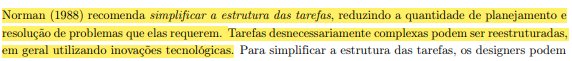
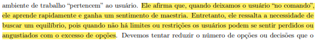
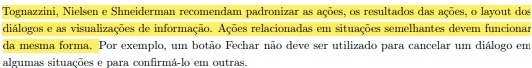

## Introdução

 A verificação é uma das fases cruciais no desenvolvimento de um projeto. Durante essa etapa, os artefatos gerados são minuciosamente examinados para assegurar que atendam aos requisitos estabelecidos. Portanto, este documento apresenta o cronograma elaborado para a verificação dos artefatos desenvolvidos pelo nosso grupo acerca dos princípios gerais. 

## Metodologia

 O método escolhido para a verificação é o de inspeção. Este método permite uma análise minuciosa dos artefatos, envolvendo uma equipe de revisores que trazem diferentes perspectivas, aumentando a probabilidade de detectar problemas. Esse método também facilita a documentação dos achados, permitindo um acompanhamento detalhado das correções necessárias. 
 

### Participantes

 A integrante <strong>Daniela Alarcão</strong> é a responsável pela elaboração da lista de verificação dos princípios gerais da etapa 3. A verificação deste artefato é de responsabilidade do integrante <strong>Pedro Henrique.</strong> A revisão do checklist é de responsabilidade do integrante <strong>Lucas Avelar</strong>.

### Template de Checklist: Princípios Gerais
- **Item 1:** A fim de corresponder com as expectativas do usuário, os princípios gerais do projeto se preocupam em seguir as convenções do mundo real, garantindo que as informações apareçam em uma ordem natural e lógica? 
    - **Fonte:** Barbosa, Simone D. J. et al. Interação Humano-Computador e Experiência do Usuário. Autopublicação, 2021, p. 253.
    - **Imagem:**
     
    

    
      
    
Figura 1: 10.2.1 Correspondência com as Expectativas dos Usuários. 
 

- **Item 2:** Os princípios gerais do projeto buscam de alguma forma simplificar a estrutura das tarefas?
    - **Fonte:** Barbosa, Simone D. J. et al. Interação Humano-Computador e Experiência do Usuário. Autopublicação, 2021, p. 253.
    - **Imagem:**
     
    

    
      
    
Figura 2: 10.2.2 Simplicidade nas Estruturas das Tarefas. 
 

- **Item 3:** Os princípios gerais se preocupam em estabelecer um equilíbrio entre controle e liberdade do usuário?
    - **Fonte:** Barbosa, Simone D. J. et al. Interação Humano-Computador e Experiência do Usuário. Autopublicação, 2021, p. 254.
    - **Imagem:**
     
    

    
      
    
Figura 3: 10.2.3 Equilíbrio entre Controle e Liberdade do Usuário. 
 

- **Item 4:** Os princípios gerais abordam sobre a padronização dos layouts das funcionalidades do sistema?
    - **Fonte:** Barbosa, Simone D. J. et al. Interação Humano-Computador e Experiência do Usuário. Autopublicação, 2021, p. 256.
    - **Imagem:**
     
    

    
      
    
Figura 4: 10.2.4 Consistência e Padronização. 
 

- **Item 5:** Os princípios gerais entendem a importância de priorizar a eficiência do usuário?
    - **Fonte:** Barbosa, Simone D. J. et al. Interação Humano-Computador e Experiência do Usuário. Autopublicação, 2021, p. 256.
    - **Imagem:**
     
    

    
      
    
Figura 5: 10.2.5 Promovendo a Eficiência do Usuário. 
 

- **Item 6:** Os princípios gerais buscam garantir recursos que promovam a antecipação, ou seja, que preveem o que o usuário quer e precisa?
    - **Fonte:** Barbosa, Simone D. J. et al. Interação Humano-Computador e Experiência do Usuário. Autopublicação, 2021, p. 257.
    - **Imagem:**
     
    

    
      
    
Figura 6: 10.2.6 Antecipação. 
 

- **Item 7:** No quesito "Visibilidade e Reconhecimento", os princípios gerais reconhecem a importância do feedback?
    - **Fonte:** Barbosa, Simone D. J. et al. Interação Humano-Computador e Experiência do Usuário. Autopublicação, 2021, p. 259.
    - **Imagem:**
     
    

    
      
    
Figura 7: 10.2.7 Visibilidade e Reconhecimento. 
 

- **Item 8:** Os princípios gerais se preocupam com a qualidade e a relevância do conteúdo do site?
    - **Fonte:** Barbosa, Simone D. J. et al. Interação Humano-Computador e Experiência do Usuário. Autopublicação, 2021, p. 260.
    - **Imagem:**
     
    

    
      
    
Figura 8: 10.2.8 Conteúdo Relevante e Expressão Adequada. 
 

- **Item 9:** Os princípios gerais reportam a necessidade do site ser projetado para o erro, ou seja, que assuma qualquer erro potencial que poderá ser cometido?
    - **Fonte:** Barbosa, Simone D. J. et al. Interação Humano-Computador e Experiência do Usuário. Autopublicação, 2021, p. 261.
    - **Imagem:**
     
    

    
      
    
Figura 9: 10.2.9 Projeto para Erros. 
 

## Resultado do Checklist
 <!-- template de VERIFICAÇÃO -->

<!-- 
| Item | Descrição      | Versão do Artefato | Avaliação      | Descrição do problema | Sugestão de Ação Corretiva | Observações |
| ---- | -------------- | ------------------ | -------------- | --------------------- | -------------------------- | ----------- |
|  1   | (COLOCAR DECRIÇÃO DO ITEM 1 AQUI) | (COLOCAR SE ESTÁ CONFORME OU NÃO CONFORME) |  | |
|  2   | (COLOCAR DECRIÇÃO DO ITEM 2 AQUI) | (COLOCAR VERSÃO AQUI) | (COLOCAR SE ESTÁ CONFORME OU NÃO CONFORME)|  |   |  |
|  3   | (COLOCAR DECRIÇÃO DO ITEM 3 AQUI) | (COLOCAR VERSÃO AQUI)| (COLOCAR SE ESTÁ CONFORME OU NÃO CONFORME) | |  | 
|  4   | (COLOCAR DECRIÇÃO DO ITEM 4 AQUI) | (COLOCAR VERSÃO AQUI) | (COLOCAR SE ESTÁ CONFORME OU NÃO CONFORME)  | | | |
|  5   | (COLOCAR DECRIÇÃO DO ITEM 5 AQUI) | (COLOCAR VERSÃO AQUI)| (COLOCAR SE ESTÁ CONFORME OU NÃO CONFORME)  | | |  |

Tabela (COLQUE O NUMERO DA TABELA AQUI): (COLOQUE O TÍTULO DA TABELA AQUI)

Fonte: (COLOQUE SEU NOME AQUI), 2024

<iframe width="560" height="315" 
src="(COLOQUE O LINK EMBED AQUI)" 
title="YouTube video player" frameborder="0" allow="accelerometer; autoplay; clipboard-write; encrypted-media; gyroscope; picture-in-picture; web-share" referrerpolicy="strict-origin-when-cross-origin" allowfullscreen></iframe>

Vídeo (COLOQUE O NUMERO DO VÍDEO AQUI): (COLOQUE O TÍTULO DO VÍDEO AQUI).

Fonte: (COLOQUE SEU NOME AQUI), 2024
 -->

## Conclusão

## Biografia
>- Barbosa, E. F., & Souza, S. R. S. (2017). Inspeção de Software. Instituto de Ciências Matemáticas e de Computação — ICMC/USP. Disponivel em: https://edisciplinas.usp.br/pluginfile.php/5306452/mod_resource/content/0/Aula02-Inspecao.pdf

## Referências Bibliográficas

## Histórico de Versões

| Versão |    Data    | Descrição                                 | Autor(es)                                       | Revisor(es)                                    |
| ------ | :--------: | ----------------------------------------- | ----------------------------------------------- | ---------------------------------------------- |
| `1.0`   | 18/06/2024 | Criação da página                         | [Mariana Letícia](https://github.com/Marianannn) |   |
| `2.0`   | 26/06/2024 | Adição de checklist                        | [Daniela Alarcão](https://github.com/danialarcao) |   |