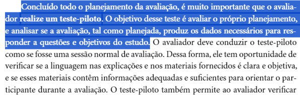

## Introdução
Estabelecer uma verificação para o Planejamento da avaliação da Analise de Tarefas é essencial para validar se o artefato foi conteplado de maneira adequada, se existem ajustes ou pendências. Desta maneira, conforme a metodologia abaixo, estabeleceremos uma lista de verificação que será revisada e depois verificada.

## Metodologia
A metodologia à ser contemplada será conduzida por meio do que já foi estabelecido no Planejamento da Verificação. Desta forma, conforme foi definido no template padronizado, estabeleceremos uma lista de verificação para esse artefato contendo uma fonte, com um imagem abaixo, de onde o item foi retirado ou baseado.

### Participantes
A criação da lista de verificação será conduzida pelo integrante [Pedro Henrique](https://github.com/PedroHhenriq), enquanto o revisor responsável por verificar se as perguntas e itens estão adequados será [Genilson Silva](https://github.com/GenilsonJrs) e a  verificação em si da lista terá como responsável o [Lucas Avelar](https://github.com/LucasAvelar2711).

### Checklist: Planejamento da avaliação da Análise de tarefas
<!-- template de checklist -->
<!-- - **Item 1:** (COLOCAR DESCRIÇÃO AQUI)
    - **Fonte:** 
    - **Imagem:**
     

    

    

    

    
Figura 1: (COLOCAR A DESCRIÇÃO DA PERGUNTA QUI)

- **Item 2:** (COLOCAR DESCRIÇÃO)
    - **Fonte:** (COLOCAR FONTE AQUI)
    - **Imagem:** 
     

    

    

    

    
Figura 2: (COLOCAR A LEGENDA AQUI)

- **Item 3:** (COLOCAR DESCRIÇÃO)
    - **Fonte:** (COLOCAR FONTE AQUI)
    - **Imagem:**
     

    

    

    

    
Figura 3: (COLOCAR A LEGENDA AQUI)

- **Item 4:** 
    - **Fonte:** 
    - **Imagem:**
     

    

    

    

    
Figura 4: (COLOCAR A LEGENDA AQUI)

- **Item 5:** (COLOCAR DESCRIÇÃO)
    - **Fonte:** (INSERIR FONTE)
    - **Imagem:**
     

    

    

    

    
Figura 5: (COLOCAR LEGENDA AQUI)
 -->

- **Item 1:** **O contexto da avaliação da análise de tarefa está claramente definido, incluindo os objetivos da avaliação, aqueles que serão entrevistados, o motivo da avaliação e as tarefas que serão analisadas?** 
    - **Fonte:** Página 290, Capítulo 9. Barbosa, S. D. J.; Silva, B. S. da (2010) - Interação Humano-Computador.
    - **Imagem:** 

Imagem 1 - Objetivos da avaliação 

- **Item 2:** **O objetivo da avaliação está de acordo com os interesses e necessidades dos usuários, estando em conformidade com os 4 principais aspectos:  Apropriação de tecnologia pelos usuários, ideias e alternativas de design, conformidade com um padrão e problemas na interação e na interface (Hix e Hartson, 1993; Rubin, 1994; Mack e Nielsen, 1994; Sharp et al., 2007)?** 
    - **Fonte:** Página 290, Capítulo 9. Barbosa, S. D. J.; Silva, B. S. da (2010) - Interação Humano-Computador.
    - **Imagem:** 

Imagem 2 - Principais aspectos  

- **Item 3:** **As perguntas que serão conduzidas na entrevista estão alinhadas com o(s) objetivo(s) definido(s)?** 
    - **Fonte:** Página 292, Capítulo 9. Barbosa, S. D. J.; Silva, B. S. da (2010) - Interação Humano-Computador. 
    - **Imagem:** 

Imagem 3 -  Objetivos alinhado a perguntas 

- **Item 4:** **É utilizado o Framework DECIDE conforme proposto por Sharp, Rogers e Preece (2007)?** 
    - **Fonte:** Página 312, Capítulo 9. Barbosa, S. D. J.; Silva, B. S. da (2010) - Interação Humano-Computador.
    - **Imagem:** 

Imagem 4 - Framework Decide 

- **Item 5:** **O planejamento também aborda aspectos práticos da avaliação como: Recrutamento dos participantes, a utilização dos equipamentos, a preparação, orçamento, prazos e mão-de-obra disponíveis?** 
    - **Fonte:** Página 312, Capítulo 9. Barbosa, S. D. J.; Silva, B. S. da (2010) - Interação Humano-Computador.
    - **Imagem:** 

Imagem 5 - I(Identificar) 

- **Item 6:** **As perguntas desenvolvidas, assim como o planejamento, estão de acordo com o perfil do usuário que foi estabelecido previamente?** 
    - **Fonte:** Página 312, Capítulo 9. Barbosa, S. D. J.; Silva, B. S. da (2010) - Interação Humano-Computador. 
    - **Imagem:** 

Imagem 6 - Perguntas alinhadas ao perfil 

- **Item 7:** **É estabelecido um teste piloto no planejamento que foi realizado antes da avaliação?** 
    - **Fonte:** Página 307, Capítulo 9. Barbosa, S. D. J.; Silva, B. S. da (2010) - Interação Humano-Computador.
    - **Imagem:** 

Imagem 7 - Teste Piloto 

## Resultado do Checklist
  
| Item | Descrição      | Versão do Artefato | Avaliação      | Descrição do problema | Sugestão de Ação Corretiva | Observações |
| ---- | -------------- | ------------------ | -------------- | --------------------- | -------------------------- | ----------- |
|  1   | O contexto da avaliação da análise de tarefa está claramente definido, incluindo os objetivos da avaliação, aqueles que serão entrevistados, o motivo da avaliação e as tarefas que serão analisadas? | 1.0 | Sim | |
|  2   | O objetivo da avaliação está de acordo com os interesses e necessidades dos usuários, estando em conformidade com os 4 principais aspectos:  Apropriação de tecnologia pelos usuários, ideias e alternativas de design, conformidade com um padrão e problemas na interação e na interface (Hix e Hartson, 1993; Rubin, 1994; Mack e Nielsen, 1994; Sharp et al., 2007)?** | 1.0 | Sim |  |   |  |
|  3   | As perguntas que serão conduzidas na entrevista estão alinhadas com o(s) objetivo(s) definido(s)?** | 1.0| Sim | |  | 
|  4   | É utilizado o Framework DECIDE conforme proposto por Sharp, Rogers e Preece (2007)?** | 1.0 | Sim | | | |
|  5   | O planejamento também aborda aspectos práticos da avaliação como: Recrutamento dos participantes, a utilização dos equipamentos, a preparação, orçamento, prazos e mão-de-obra disponíveis?  | 1.0| Incompleto | | Revisar |  |
|  6   | As perguntas desenvolvidas, assim como o planejamento, estão de acordo com o perfil do usuário que foi estabelecido previamente? | 1.0| Sim  | | |  |
|  7   | É estabelecido um teste piloto no planejamento que foi realizado antes da avaliação? | 1.0| Sim | | |  |

Tabela 1: Resultado Checklist

Fonte: [Lucas Avelar](https://github.com/LucasAvelar2711), 2024

<iframe width="560" height="315" 
src="https://www.youtube.com/embed/qMGgOgjjdh4?si=9T4ruf8SjI4ok_rg"  
title="YouTube video player" frameborder="0" allow="accelerometer; autoplay; clipboard-write; encrypted-media; gyroscope; picture-in-picture; web-share" referrerpolicy="strict-origin-when-cross-origin" allowfullscreen></iframe>

Vídeo Planejamento avaliação: Planejamneto avaliação.

Fonte: [Lucas Avelar](https://github.com/LucasAvelar2711), 2024
 >

## Conclusão
 O grupo Apresentou bom rendimento e terá de revisar poucas coisas do artefato.
## Biografia
>- Barbosa, E. F., & Souza, S. R. S. (2017). Inspeção de Software. Instituto de Ciências Matemáticas e de Computação — ICMC/USP. Disponivel em: https://edisciplinas.usp.br/pluginfile.php/5306452/mod_resource/content/0/Aula02-Inspecao.pdf

## Referências Bibliográficas
> - Barbosa, S. D. J.; Silva, B. S. da (2010) Interação Humano-Computador.

## Histórico de Versões

| Versão |    Data    | Descrição                                 | Autor(es)                                       | Revisor(es)                                    |
| ------ | :--------: | ----------------------------------------- | ----------------------------------------------- | ---------------------------------------------- |
| `1.0`   | 18/06/2024 | Criação da página                         | [Mariana Letícia](https://github.com/Marianannn) |  [Pedro Henrique](https://github.com/PedroHhenriq) |
| `2.0`   | 26/06/2024 | Criação da lista de verificação do Planjemento da Avaliação da Analise de Tarefas                       | [Pedro Henrique](https://github.com/PedroHhenriq) |  [Mariana Letícia](https://github.com/Marianannn) |
| `3.0`   | 26/06/2024 | Fazendo checklist                      | [Lucas Avelar](https://github.com/LucasAvelar2711) |  [Pedro Henrique](https://github.com/PedroHhenriq) |