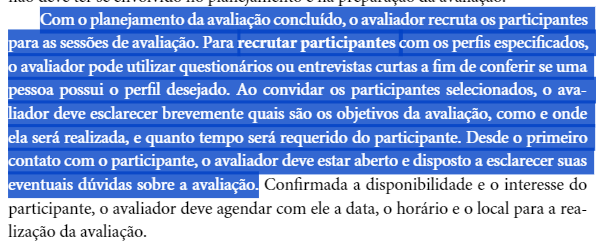

## Introdução
Desenvolver uma verificação para o Planejamento do Relato de Resultados da Analise de Tarefas é uma etapa fundamental para identificarmos se o método que será empregado está adequado ou se existem itens que possam estar faltando. Afinal, será por meio da verificação que poderemos encontrar erros e, posteriormente corrigi-los. 

Assim, segue abaixo metodologia, participantes, lista e verificação:

## Metodologia
A metodologia que foi adota é aquela que foi empregada dentro do Planejamento da Verificação. Assim sendo, conforme foi padronizado a partir do template definido, o checklist conterá os itens, assim como também, a fonte e uma imagem representativa de onde o item se baseou logo abaixo. 

### Participantes
O avaliador responsável pelo criação da lista de verificação desse artefato será o [Pedro Henrique](https://github.com/PedroHhenriq), enquanto o revisor designado pela aplicação da verificação à etapa será o [Genilson Silva](https://github.com/GenilsonJrs).

### Checklist: Planejamento da avaliação do relato de resultados da Análise de tarefas
<!-- template de checklist -->
<!-- - **Item 1:** (COLOCAR DESCRIÇÃO AQUI)
    - **Fonte:** 
    - **Imagem:**
     

    

    

    

    
Figura 1: (COLOCAR A DESCRIÇÃO DA PERGUNTA QUI)

- **Item 2:** (COLOCAR DESCRIÇÃO)
    - **Fonte:** (COLOCAR FONTE AQUI)
    - **Imagem:** 
     

    

    

    

    
Figura 2: (COLOCAR A LEGENDA AQUI)

- **Item 3:** (COLOCAR DESCRIÇÃO)
    - **Fonte:** (COLOCAR FONTE AQUI)
    - **Imagem:**
     

    

    

    

    
Figura 3: (COLOCAR A LEGENDA AQUI)

- **Item 4:** 
    - **Fonte:** 
    - **Imagem:**
     

    

    

    

    
Figura 4: (COLOCAR A LEGENDA AQUI)

- **Item 5:** (COLOCAR DESCRIÇÃO)
    - **Fonte:** (INSERIR FONTE)
    - **Imagem:**
     

    

    

    

    
Figura 5: (COLOCAR LEGENDA AQUI)
 -->

- **Item 1:** **Os tópicos do relato de resultados incluem: Objetivos e escopo da avaliação, método, seleção de participantes, dados coletados, interpretação e analise dos dados, lista de problemas e reprojeto?** 
    - **Fonte:** Página 312, Capítulo 9. Barbosa, S. D. J.; Silva, B. S. da (2010) - Interação Humano-Computador.
    - **Imagem:** 

Imagem 1 - Relato dos resultados  

- **Item 2:** **É descrito o método que será utilizado, assim como o motivo de terem o escolhido?** 
    - **Fonte:** Página 301, Capítulo 9. Barbosa, S. D. J.; Silva, B. S. da (2010) - Interação Humano-Computador.
    - **Imagem:** 

Imagem 2 - Método escolhido 

- **Item 3:** **É descrito a forma como será realizada o recrutamento de usuários? Essa seleção está de acordo com o perfil do usuário?** 
    - **Fonte:** Página 308, Capítulo 9. Barbosa, S. D. J.; Silva, B. S. da (2010) - Interação Humano-Computador.
    - **Imagem:** 

Imagem 3 -  Seleção de Participantes 

- **Item 4:** **Os dados foram extraídos e coletados de acordo com o método escolhido? O relato registra essas dados conforme foi previamente estabelecido?** 
    - **Fonte:** Página 308, Capítulo 9. Barbosa, S. D. J.; Silva, B. S. da (2010) - Interação Humano-Computador.
    - **Imagem:** 

Imagem 4 - Dados de acordo com método 

## Resultado do Checklist

### Planejamento do Relato - Revisor: Genilson Silva

| Item | Descrição | Versão do Artefato | Avaliação | Descrição do problema | Sugestão de Ação Corretiva | Observações |
| ---- | --------- | ------------------ | --------- | --------------------- | -------------------------- | ----------- |
|  1   | Os tópicos do relato de resultados incluem: Objetivos e escopo da avaliação, método, seleção de participantes, dados coletados, interpretação e análise dos dados, lista de problemas e reprojeto? | 1.0 | Conforme | | | |
|  2   | É descrito o método que será utilizado, assim como o motivo de terem o escolhido? | 1.0 | Conforme | | | Pode ser melhor explicada a forma como se deu a escolha.|
|  3   | É descrito a forma como será realizada o recrutamento de usuários? Essa seleção está de acordo com o perfil do usuário? | 1.0 | Conforme | | | |
|  4   | Os dados foram extraídos e coletados de acordo com o método escolhido? O relato registra esses dados conforme foi previamente estabelecido? | 1.0 | Conforme | | | |

Tabela 1: Verificação do Planejamento do Relato. 

Fonte: Genilson Silva, 2024

**A gravação da verificação encontra-se abaixo:**

<iframe width="560" height="315" src="https://www.youtube.com/embed/Am0OKONN3P0?si=SkxzHWdnnu0uBDIO" title="YouTube video player" frameborder="0" allow="accelerometer; autoplay; clipboard-write; encrypted-media; gyroscope; picture-in-picture; web-share" referrerpolicy="strict-origin-when-cross-origin" allowfullscreen></iframe>

Video 1: Verificação do Planejamento do Relato.

Fonte: Genilson Silva, 2024.

## Biografia
>- Barbosa, E. F., & Souza, S. R. S. (2017). Inspeção de Software. Instituto de Ciências Matemáticas e de Computação — ICMC/USP. Disponivel em: https://edisciplinas.usp.br/pluginfile.php/5306452/mod_resource/content/0/Aula02-Inspecao.pdf

## Referências Bibliográficas
> - Barbosa, S. D. J.; Silva, B. S. da (2010) Interação Humano-Computador.

## Histórico de Versões

| Versão |    Data    | Descrição                                 | Autor(es)                                       | Revisor(es)                                    |
| ------ | :--------: | ----------------------------------------- | ----------------------------------------------- | ---------------------------------------------- |
| `1.0`   | 18/06/2024 | Criação da página                         | [Mariana Letícia](https://github.com/Marianannn) |  [Genilson Silva](https://github.com/GenilsonJrs) |
| `2.0`   | 26/06/2024 | Criação da lista de verificação do Planejamento de Relato de Resultados da Analise de Tarefas                   | [Pedro Henrique](https://github.com/PedroHhenriq) | [Genilson Silva](https://github.com/GenilsonJrs)  |
| `3.0`   | 26/06/2024 | Checklist de verificação do Planejamento de Relato de Resultados da Analise de Tarefas                   | [Genilson Silva](https://github.com/GenilsonJrs) |   |