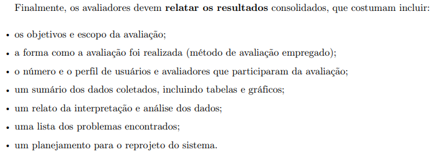
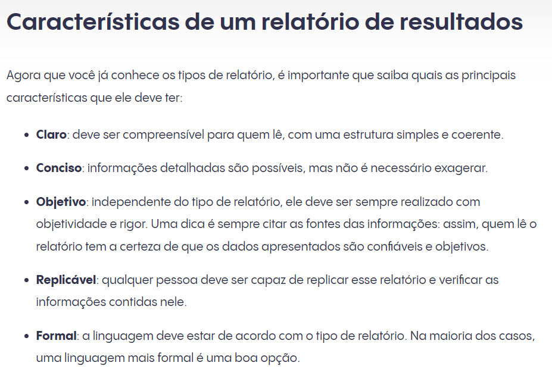

## Introdução
Verificar o planejamento do relato dos resultados é fundamental para conseguir organizar a maneira como os avaliadores coletarão e analisarão os dados para pesquisas futuras e para o reprojeto. 

Sendo assim este documento compreende a metodologia, os templates de checklists e os resultados da avaliação conforme esses templates, todos focados no planejamento da avaliação do relato dos resultados do storyboard.

## Metodologia
Será inicialmente evidenciado todos os checklists a serem verificados e depois os avaliadores irão inserir uma tabela, como consta no [Planejamento da verificação](../../../planejamento_verificacao.md), com os devidos resultados das análises feitas. 

A verificação será feita através da inspeção. Os maiores detalhes sobre como funciona a metodologia estão no [Planejamento da verificação](../../../planejamento_verificacao.md).

### Participantes
A **avaliadora** responsável por desenvolver a lista de verificação da etapa 4 para o grupo 7 será a [Mariana Letícia](https://github.com/Marianannn), a revisora do checklist será [Bruna Lima](https://github.com/libruna) e a **verificadora** será [Daniela Alarcão](https://github.com/danialarcao).

### Checklist: Planejamento do Relato dos Resultados do StoryBoard

- **Item 1:** O relato dos resultados possui objetivos, método, numero e perfil dos usuários e avaliadores, sumário de dados coletados, interpretação e análise de dados, os problemas encontrados, e planejamento para reprojeto, assim como consta na figura 1 a seguir?
    - **Fonte:**  Barbosa, Simone D. J. et al. Interação Humano-Computador e Experiência do Usuário. Autopublicação, 2021, p. 279
    - **Imagem:**
     

    

    

    

    
Figura 1: Elementos necessários na estrutura no relato dos resultados.

- **Item 2:** O relato dos resultados é claro, conciso, objetivo, replicável e formal como é evidente na figura 2 a seguir?
    - **Fonte:**  INBOUNDCYCLE. Como montar um relatório de resultados. Disponível em: https://www.inboundcycle.com/pt/blog-de-inbound-marketing/como-montar-um-relatorio-de-resultados. Acesso em: 23 jun. 2024
    - **Imagem:**
     

    

    

    

    
Figura 2: Elementos necessários na execução do relato dos resultados.

## Resultado do Checklist
| Item | Descrição      | Versão do Artefato | Avaliação      | Descrição do problema | Sugestão de Ação Corretiva | Observações |
| ---- | -------------- | ------------------ | -------------- | --------------------- | -------------------------- | ----------- |
|  1   | O relato dos resultados possui objetivos, método, numero e perfil dos usuários e avaliadores, sumário de dados coletados, interpretação e análise de dados, os problemas encontrados, e planejamento para reprojeto, assim como consta na figura 1 a seguir? | 2.0 | Conforme | |
|  2   |  O relato dos resultados é claro, conciso, objetivo, replicável e formal como é evidente na figura 2 a seguir? | 2.0 | Conforme |  |   |  |

Tabela 1 : Resultado de Checklist

Fonte: Daniela Alarcão, 2024

<iframe width="853" height="480" src="https://www.youtube.com/embed/ncVxB96fsuE?si=O6Q-M3rUwMJk_kJP" title="YouTube video player" frameborder="0" allow="accelerometer; autoplay; clipboard-write; encrypted-media; gyroscope; picture-in-picture; web-share" referrerpolicy="strict-origin-when-cross-origin" allowfullscreen></iframe>

Vídeo 1: Verificação de artefato - planejamento do relato dos resultados do storyboard.

Fonte: Daniela Alarcão, 2024
 

## Biografia
>- Barbosa, E. F., & Souza, S. R. S. (2017). Inspeção de Software. Instituto de Ciências Matemáticas e de Computação — ICMC/USP. Disponivel em: https://edisciplinas.usp.br/pluginfile.php/5306452/mod_resource/content/0/Aula02-Inspecao.pdf

## Histórico de Versões

| Versão |    Data    | Descrição                                 | Autor(es)                                       | Revisor(es)                                    |
| ------ | :--------: | ----------------------------------------- | ----------------------------------------------- | ---------------------------------------------- |
| `1.0`   | 18/06/2024 | Criação da página                         | [Mariana Letícia](https://github.com/Marianannn) | [Bruna Lima](https://github.com/libruna)  |
| `2.0`   | 23/06/2024 | adicão de introdução e template de checklist do storyboard                          | [Mariana Letícia](https://github.com/Marianannn) | [Bruna Lima](https://github.com/libruna)  |
| `3.0`   | 26/06/2024 | Verificação do artefato | [Daniela Alarcão](https://github.com/danialarcao) |  [Bruna Lima](https://github.com/libruna) |