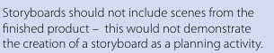

## Introdução
A verificação é uma etapa crítica no desenvolvimento de software, com o objetivo de garantir sua qualidade e desempenho adequado.

Nesse contexto, apresentamos a verificação do Planejamento da Avaliação do Storyboard do [Grupo 07](https://interacao-humano-computador.github.io/2024.1-CBMERJ) (Corpo de Bombeiros Militar do Estado do Rio de Janeiro).

## Metodologia
Considerando o método definido no planejamento, a verificação ocorrerá por meio da inspeção. 

### Participantes
A [Bruna Lima](https://github.com/libruna) ficou responsável pela elaboração da lista de verificação, enquanto a [Mariana Letícia](https://github.com/Marianannn) ficou responsável pela revisão da lista. Além disso, para a verificação deste artefato, cada membro do Grupo 07 irá avaliar um storyboard de uma funcionalidade desenvolvido por outro integrante do grupo.

## Checklist: Storyboard
A lista de verificações abaixo detalha os aspectos que serão analisados durante a verificação do artefato, com suas respectivas fontes e imagens de referência.

- **Item 1:** **Aprensenta as quatro características principais de um storyboard: o cenário, as atividades, os visuais e a história?** 
    - **Fonte:** Tópico 4. O que é um storyboard? Miro: *https://miro.com/pt/storyboard/o-que-e-storyboard/*
    - **Imagem:**  
    

Imagem 1 - Destaque no site sobre as características principais de um storyboard. 

- **Item 2:** **Outros elementos-chave, como personagens, enredo, diálogo e dicas visuais, foram incluídos no storyboard?** 
    - **Fonte:** Storyboarding Eficaz, StoryboardThat. *https://www.storyboardthat.com/pt/articles/e/como-fazer-seu-storyboards-pop*
    - **Imagem:** 

Imagem 2 - Destaque no site sobre o que um storyboard deve incluir. 

- **Item 3:** **Os desenhos do storyboard são simples e claros?** 
    - **Fonte:** Storyboarding Eficaz, StoryboardThat. *https://www.storyboardthat.com/pt/articles/e/como-fazer-seu-storyboards-pop*
    - **Imagem:** 

Imagem 3 - Destaque no site sobre práticas recomendadas para storyboards. 

- **Item 4:** **É possível confirmar que o storyboard criado não possui cenas/imagens do produto final?** 
    - **Fonte:** Página 9, Tópico "Descriptive content of a storyboard".*THE OCR GUIDE TO STORYBOARDS - Skill Guide*
    - **Imagem:**  
    

Imagem 4 - Destaque no guia sobre conteúdo de um storyboard. 

- **Item 5:** **O storyboard consegue transmitir a ideia de uso da funcionalidade em um contexto real?** 
    - **Fonte:** Storyboarding Eficaz, StoryboardThat. *https://www.storyboardthat.com/pt/articles/e/como-fazer-seu-storyboards-pop*
    - **Imagem:** 

Imagem 5 - Destaque no site sobre importância dos storyboards. 

## Resultado do Checklist

### Funcionalidade: Primeiros Socorros - Revisor: Daniela Oliveira Alarcão 

| Item | Descrição      | Versão do Artefato | Avaliação      | Descrição do problema | Sugestão de Ação Corretiva | Observações |
| ---- | -------------- | ------------------ | -------------- | --------------------- | -------------------------- | ----------- |
|  1   | Aprensenta as quatro características principais de um storyboard: o cenário, as atividades, os visuais e a história?  | 1.6 | Conforme |  |  | |
|  2   | Outros elementos-chave, como personagens, enredo, diálogo e dicas visuais, foram incluídos no storyboard? | 1.6 | Conforme |  |  | |
|  3   | Os desenhos do storyboard são simples e claros? | 1.6 | Conforme |  |  | |
|  4   | É possível confirmar que o storyboard criado não possui cenas/imagens do produto final? | 1.6 | Conforme  |  |  | |
|  5   | O storyboard consegue transmitir a ideia de uso da funcionalidade em um contexto real? | 1.6 | Conforme |  |  | |

Tabela número: 1.

Fonte: Daniela Alarcão, 2024

### Funcionalidade: Solicitar Ficha de Atendimento - Revisora: Mariana Letícia

| Item | Descrição      | Versão do Artefato | Avaliação      | Descrição do problema | Sugestão de Ação Corretiva | Observações |
| ---- | -------------- | ------------------ | -------------- | --------------------- | -------------------------- | ----------- |
|  1   | Aprensenta as quatro características principais de um storyboard: o cenário, as atividades, os visuais e a história?  | 1.6 | conforme |  |  | |
|  2   | Outros elementos-chave, como personagens, enredo, diálogo e dicas visuais, foram incluídos no storyboard? | 1.6 | conforme |  |  | |
|  3   | Os desenhos do storyboard são simples e claros? | 1.6 | conforme |  |  | |
|  4   | É possível confirmar que o storyboard criado não possui cenas/imagens do produto final? | 1.6 | conforme  |  |  | |
|  5   | O storyboard consegue transmitir a ideia de uso da funcionalidade em um contexto real? |1.6 | conforme |  | |

Tabela 2: Verificação do Storyboard Solicitar ficha de atendimento 

Fonte: Mariana Letícia, 2024

<iframe width="560" height="315" src="https://www.youtube.com/embed/BgJfh32HxXI?si=aXogi0SZ-aYCFryP" title="YouTube video player" frameborder="0" allow="accelerometer; autoplay; clipboard-write; encrypted-media; gyroscope; picture-in-picture; web-share" referrerpolicy="strict-origin-when-cross-origin" allowfullscreen></iframe>

Vídeo 2: Verificação do Storyboard Solicitar ficha de atendimento .

Fonte: Mariana Letícia, 2024

### Funcionalidade: Agendamento de atendimento presencial - Revisor: Pedro Henrique 

| Item | Descrição      | Versão do Artefato | Avaliação      | Descrição do problema | Sugestão de Ação Corretiva | Observações |
| ---- | -------------- | ------------------ | -------------- | --------------------- | -------------------------- | ----------- |
|  1   | Aprensenta as quatro características principais de um storyboard: o cenário, as atividades, os visuais e a história?  | 1.6 | Conforme |  |  | Está adequado |
|  2   | Outros elementos-chave, como personagens, enredo, diálogo e dicas visuais, foram incluídos no storyboard? | 1.6 | Conforme |  |  | Está adequado |
|  3   | Os desenhos do storyboard são simples e claros? | 1.6 | Conforme |  |  | Está adequado |
|  4   | É possível confirmar que o storyboard criado não possui cenas/imagens do produto final? | 1.6 | Conforme  |  |  | Está adequado |
|  5   | O storyboard consegue transmitir a ideia de uso da funcionalidade em um contexto real? |1.6 | Conforme |  | Está adequado |

Tabela numero 3: Solicitar Ficha de Atendimento  .

Fonte: Pedro Henrique, 2024

**A gravação da verificação encontra-se abaixo:**

[Link para o vídeo da apresentação](https://www.youtube.com/watch?v=w0BFFBMlfhg)

<iframe width="882" height="496" src="https://www.youtube.com/embed/w0BFFBMlfhg" title="Verificaca Storyboard" frameborder="0" allow="accelerometer; autoplay; clipboard-write; encrypted-media; gyroscope; picture-in-picture; web-share" referrerpolicy="strict-origin-when-cross-origin" allowfullscreen></iframe>

Vídeo numero: 3.

Fonte: Pedro Henrique, 2024.

### Funcionalidade: Checar e Gerar Certificado - Revisora: Bruna Lima

| Item | Descrição      | Versão do Artefato | Avaliação      | Descrição do problema | Sugestão de Ação Corretiva | Observações |
| ---- | -------------- | ------------------ | -------------- | --------------------- | -------------------------- | ----------- |
|  1   | Aprensenta as quatro características principais de um storyboard: o cenário, as atividades, os visuais e a história?  | 1.6 | conforme |  |  | |
|  2   | Outros elementos-chave, como personagens, enredo, diálogo e dicas visuais, foram incluídos no storyboard? | 1.6 | Conforme |  |  | Apresenta todos os elementos, mas poderiam ser melhor explorados. |
|  3   | Os desenhos do storyboard são simples e claros? | 1.6 | Conforme |  |  | |
|  4   | É possível confirmar que o storyboard criado não possui cenas/imagens do produto final? | 1.6 | Conforme  |  |  | |
|  5   | O storyboard consegue transmitir a ideia de uso da funcionalidade em um contexto real? | 1.6 | Conforme |  | |

Tabela 4: Verificação do Storyboard Checar e Gerar Certificado. 

Fonte: Bruna Lima, 2024

**A gravação da verificação encontra-se abaixo:**

[Link para o vídeo da apresentação](https://youtu.be/rp8WlU0hI1g)

<iframe width="560" height="315" src="https://www.youtube.com/embed/rp8WlU0hI1g?si=xZdsyUAetdUiklfl" title="YouTube video player" frameborder="0" allow="accelerometer; autoplay; clipboard-write; encrypted-media; gyroscope; picture-in-picture; web-share" referrerpolicy="strict-origin-when-cross-origin" allowfullscreen></iframe>

Video 4: Verificação do storyboard da funcionalidade de Checar e Gerar Certificado.

Fonte: Bruna Lima, 2024.

### Funcionalidade: Obter Declaração do Registro de Ocorrência - Revisor: Genilson Silva

| Item | Descrição      | Versão do Artefato | Avaliação      | Descrição do problema | Sugestão de Ação Corretiva | Observações |
| ---- | -------------- | ------------------ | -------------- | --------------------- | -------------------------- | ----------- |
|  1   | Aprensenta as quatro características principais de um storyboard: o cenário, as atividades, os visuais e a história?  | 1.6 | conforme |  |  | |
|  2   | Outros elementos-chave, como personagens, enredo, diálogo e dicas visuais, foram incluídos no storyboard? | 1.6 | Conforme |  |  | |
|  3   | Os desenhos do storyboard são simples e claros? | 1.6 | Conforme |  |  | |
|  4   | É possível confirmar que o storyboard criado não possui cenas/imagens do produto final? | 1.6 | Conforme  |  |  | |
|  5   | O storyboard consegue transmitir a ideia de uso da funcionalidade em um contexto real? | 1.6 | Conforme |  | |

Tabela 5: Verificação do Storyboard Obter Declaração do Registro de Ocorrência. 

Fonte: Genilson Silva, 2024

**A gravação da verificação encontra-se abaixo:**

[Link para o vídeo da apresentação](https://youtu.be/XzSWhwTluCw?si=QkVaIdouuQJvjGTX)

<iframe width="560" height="315" src="https://www.youtube.com/embed/XzSWhwTluCw?si=WrbXl0mJeOuWzzA-" title="YouTube video player" frameborder="0" allow="accelerometer; autoplay; clipboard-write; encrypted-media; gyroscope; picture-in-picture; web-share" referrerpolicy="strict-origin-when-cross-origin" allowfullscreen></iframe>

Video 5: Verificação do storyboard da funcionalidade de Obter Declaração do Registro de Ocorrência.

Fonte: Genilson Silva, 2024.

<!-- ### Funcionalidade:  - Revisor: Lucas Aevlar

| Item | Descrição      | Versão do Artefato | Avaliação      | Descrição do problema | Sugestão de Ação Corretiva | Observações |
| ---- | -------------- | ------------------ | -------------- | --------------------- | -------------------------- | ----------- |
|  1   |  | | |  |  | |

Tabela numero: .

Fonte: autor, 2024

**A gravação da verificação encontra-se abaixo:**

[Link para o vídeo da apresentação]()

<!-- iframe aqui-->

Vídeo numero: .

Fonte: autor, 2024.

 -->

## Biografia
> - O que é um storyboard? Miro. Disponível em: https://miro.com/pt/storyboard/o-que-e-storyboard/
> - Como fazer seu storoboard. StoryboardThat. Disponível em: https://www.storyboardthat.com/pt/articles/e/como-fazer-seu-storyboards-pop
> - THE OCR GUIDE TO STORYBOARDS - Skill Guide. Disponível em: https://www.ocr.org.uk/Images/579489-guide-to-storyboards.pdf

## Histórico de Versões

| Versão |  Data  | Descrição  | Autor(es) | Revisor(es) |
| ------ | :----: | ---------- | --------- | ----------- |
| `1.0`   | 25/06/2024 | Criação da página e adição do checklist | [Bruna Lima](https://github.com/libruna) |   |
| `2.0`   | 26/06/2024 | Adição do checklist do storyboard primeiros socorros  | [Daniela Alarcão](https://github.com/danialarcao) |  [Bruna Lima](https://github.com/libruna) |
| `3.0`   | 26/06/2024 | Adição do checklist do storyboard checar e gerar certificado  | [Bruna Lima](https://github.com/libruna) |  [Mariana Letícia](https://github.com/Marianannn) |
| `4.0`   | 26/06/2024 | Adição do checklist do Agendamento de atendimento presencial  | [Pedro Henrique](https://github.com/PedroHhenriq) | [Bruna Lima](https://github.com/libruna)  |
| `5.0`   | 26/06/2024 | Adição do checklist de Obter Declaração do Registro de Ocorrência  | [Genilson Silva](https://github.com/GenilsonJrs) |  [Bruna Lima](https://github.com/libruna) |
| `6.0`   | 26/06/2024 | Adição do checklist de Obter Declaração do Registro de Ocorrência  | [Mariana Letícia](https://github.com/Marianannn) |  [Bruna Lima](https://github.com/libruna) |